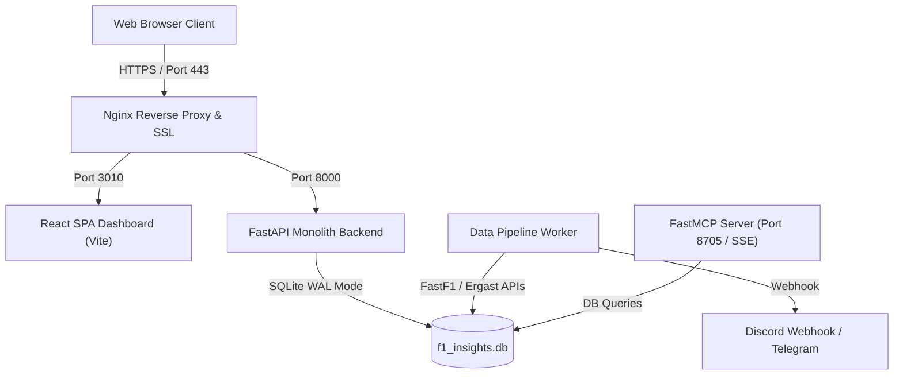
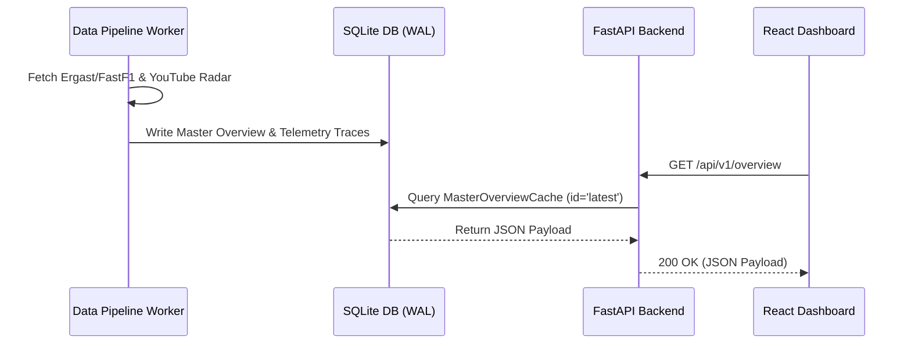

# Architecture Requirements & Decisions (ARD)
## 🏛️ F1 Insights & Explanation Platform (v2026.10)

---

## 1. Architectural Style & Overview

The system is designed as a **Modular Monolith** in Python 3.11+, supported by a single-page React frontend and an autonomous data pipeline worker daemon.

---

## 2. Key Architecture Decision Records (ADRs)

### ADR-001: Modular Monolith over Microservices
*   **Context**: The application handles race weekend telemetry, FIA points, and AI briefing generation.
*   **Decision**: Adopt a Modular Monolith in Python (FastAPI).
*   **Rationale**: Eliminates network latency between microservices, simplifies deployments to a single VPS via PM2, and allows shared memory access to database schemas.

### ADR-002: SQLite in WAL Mode as Single Source of Truth
*   **Context**: Needs concurrent read access from FastAPI web requests, FastMCP tools, and background pipeline writes.
*   **Decision**: Use SQLite 3 with Write-Ahead Logging (`PRAGMA journal_mode=WAL; PRAGMA synchronous=NORMAL;`).
*   **Rationale**: Supports thousands of concurrent readers with zero lock contention. Eliminates operational complexity of external DB clusters.

### ADR-003: Dual-Layer Fallback Architecture
*   **Context**: External APIs (FastF1, Ergast, Jolpica) can experience outages during high-concurrency race weekends.
*   **Decision**: Implement a two-tiered fallback mechanism:
    1.  **Tier 1 (Database Cache)**: Query `MasterOverviewCache` table in SQLite (`f1_insights.db`).
    2.  **Tier 2 (Static Disk Asset)**: Fall back to static JSON feed at `portal/public/data/overview.json`.
*   **Rationale**: Guarantees $100\%$ uptime for the frontend dashboard even if SQLite or third-party APIs fail entirely.

### ADR-004: Native FastMCP Server for Agentic LLM Access
*   **Context**: AI agents (Claude, Gemini, Hermes) need clean, structured access to F1 telemetry and FIA data.
*   **Decision**: Deploy a dedicated FastMCP server (`mcp_server/main.py`) exposing standardized tool interfaces.
*   **Rationale**: Implements Schema v4.0 with provenance metadata (`confidence`, `source`, `generated_at`).

### ADR-005: Full 20-Driver Grid Data Normalization & Telemetry Selection
*   **Context**: Legacy frontend components sliced standings/results or telemetry pickers to partial grids (e.g. top 5 or 7 hardcoded drivers).
*   **Decision**: Mandate that all session classifications, standings, and interactive tools (including `TelemetryOverlayTool`) support all 20 active drivers dynamically from season standings.
*   **Rationale**: Ensures complete grid visibility, driver comparison flexibility, and position movement tracking across all 20 drivers.

### ADR-006: CI/CD Pipeline as Exclusive VPS Deployment Mechanism
*   **Context**: Direct manual SSH deployments to VPS risk environment drift and unverified code pushes.
*   **Decision**: Enforce GitHub Actions CI/CD workflow (`.github/workflows/deploy.yml`) as the **ONLY** path to VPS deployment. Local verification MUST pass first (`pytest`, `npm run build`).
*   **Rationale**: Guarantees that only tested, verified artifacts reach production environments.

---

## 3. Data Flow Architecture

---

## 4. Operational & Deployment Architecture

*   **Process Manager**: Managed via PM2 using [`ecosystem.config.js`](file:///Users/mathias/Development/Projects/f1-insights/ecosystem.config.js):
    *   `f1-backend`: FastAPI running under Uvicorn (`port 8000`).
    *   `f1-pipeline-scheduler`: Python daemon executing session checkpoints and briefing generation.
    *   `f1-portal`: Vite preview server (`port 3010`).
*   **Deployment Pipeline**: GitHub Actions implementing **M3-Conventions §3 (CI-builds-the-artifact)** via SSH/rsync to `m3-vps` with automated health checks (`/api/v1/health`).

