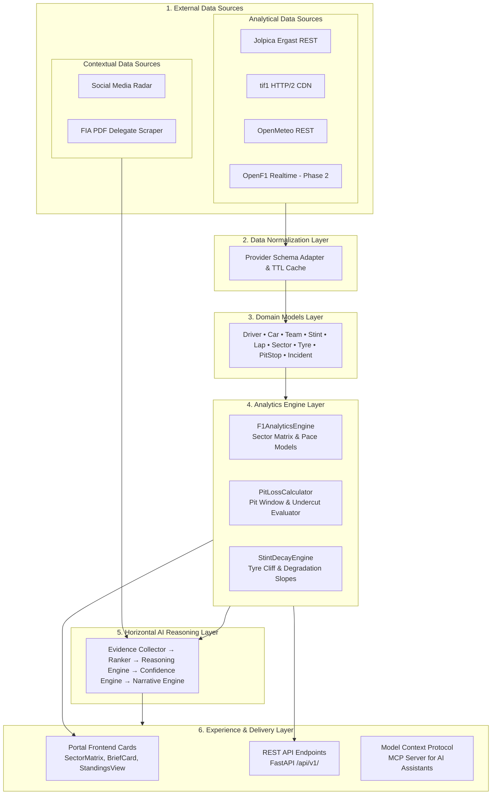
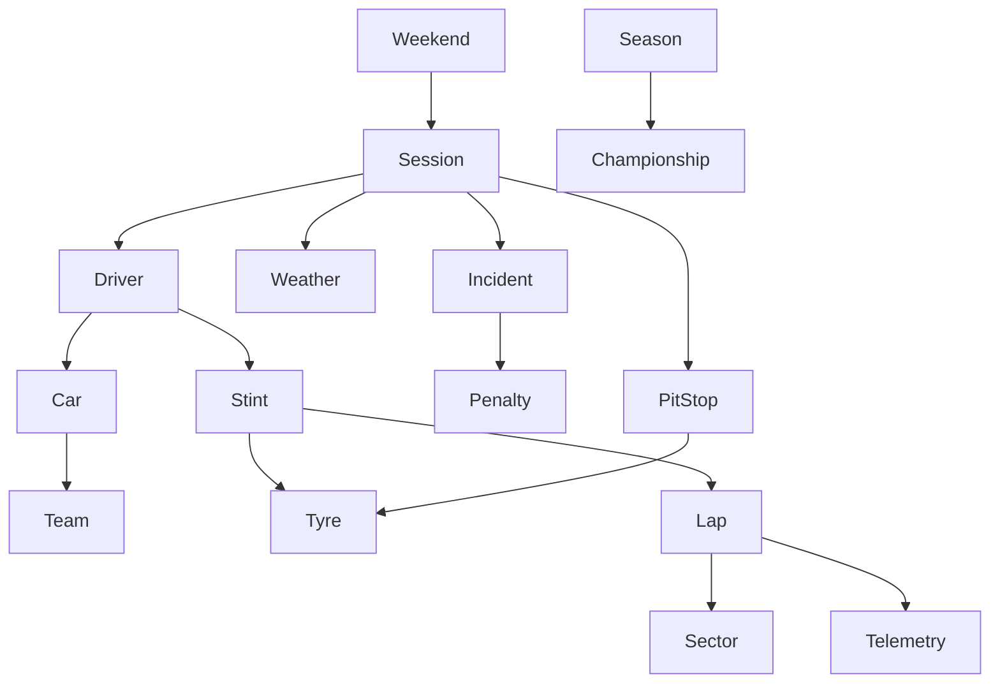
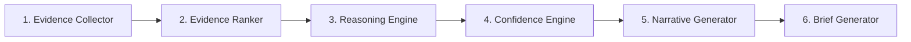
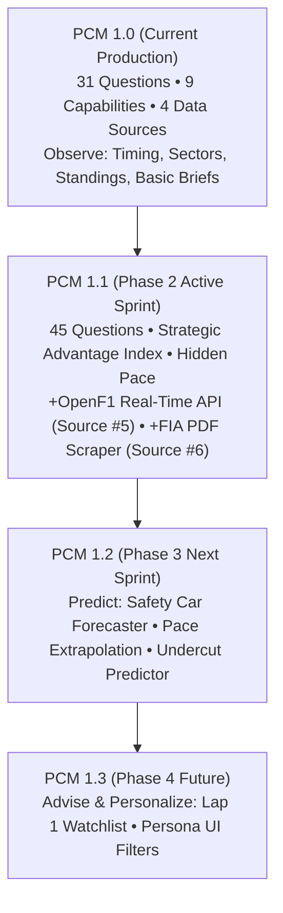

# F1 Insights — Platform Architecture Whitepaper & Specification
## Platform Capability Model (PCM) v1.0 / Architecture Spec v2026.10

> **Architectural Vision**: *"F1 Insights is an explainable race intelligence platform that transforms multi-provider motorsport data into actionable understanding. Rather than replacing official timing, it augments it by answering the questions fans, analysts, and engineers naturally ask: what happened, why it happened, what is likely to happen next, and what deserves attention now. Every insight is evidence-backed, confidence-scored, and transparent about its limitations."*

---

## 🎯 1. Guiding Design Principles & Non-Goals

### 1.1 Design Principles
1. **Question-Driven**: Every capability exists solely to answer a natural question an F1 fan, analyst, or strategist asks.
2. **Evidence-Backed**: Every insight is supported by observable data, deterministic algorithms, or multi-point telemetry.
3. **Explicit Confidence**: Confidence is explicitly calculated ($70\% - 100\%$) and explainable—never implied or hidden.
4. **Transparent Boundaries**: Known data limitations and external constraints are surfaced rather than masked.
5. **Explainable AI**: AI explains and synthesizes empirical evidence rather than inventing narratives.

### 1.2 Architectural Non-Goals
F1 Insights intentionally does **NOT** attempt to:
* ❌ Predict race outcomes with 100% certainty (motorsport is inherently stochastic).
* ❌ Replace official FIA timing screens or TV broadcast graphic feeds.
* ❌ Access or guess private team IP (internal MGU-K cell temps, wing flex pressure maps).
* ❌ Hallucinate explanations unsupported by empirical timing or telemetry evidence.
* ❌ Use unverified social media signals to calculate mathematical performance metrics.

### 1.3 System Quality Attributes

| Quality Attribute | Goal & Architectural Mechanism |
| :--- | :--- |
| **Explainability** | Every generated insight references a 3-tier evidence chain (Evidence $\rightarrow$ Reasoning $\rightarrow$ Conclusion). |
| **Extensibility** | External data providers implement a `BaseProvider` interface, allowing new sources to be added without touching analytics logic. |
| **Modularity** | Analytics engines (`StintDecayEngine`, `PitLossCalculator`) are decoupled micro-modules with isolated unit test suites. |
| **Transparency** | System confidence is calculated via multi-weight composition and displayed on every output. |
| **Traceability** | Every insight links directly back to raw provider timestamps and commit SHAs. |

---

## 🏗️ 2. System Architecture & 5-Layer Decoupling

F1 Insights strictly decouples Data Sources, Data Normalization, Domain Models, Analytics Engines, the AI Layer, and the Multi-Channel Delivery Layer:

---

## 🌐 3. Domain Knowledge Model & Entity Relationships

The Domain Models Layer structures motorsport reality into 16 core entities and their relationships. Every insight is produced via graph traversal across these domain objects:

### Knowledge Graph Traversal Example
To answer *"Who has hidden pace in traffic?"*, the engine traverses:
$$\text{Driver} \longrightarrow \text{Stint} \longrightarrow \text{Lap} \longrightarrow \text{Sector} \longrightarrow \text{Telemetry} \quad \Big(\text{filtering out } \text{Traffic Laps } [ \text{Gap} < 1.0\text{s} ] \Big) \longrightarrow \text{Clean-Air Delta}$$

---

## 🤖 4. Formalized AI Reasoning Pipeline

Instead of treating AI as a black box, the Horizontal AI Reasoning Layer processes every query through a 6-stage pipeline:

### Pipeline Stage Responsibilities
1. **Evidence Collector**: Fetches raw domain objects (laps, telemetry, weather, flags).
2. **Evidence Ranker**: Ranks data inputs by empirical reliability (Telemetry ★★★★★ > Historical ★★★★☆ > Social ★☆☆☆☆).
3. **Reasoning Engine**: Synthesizes facts to test hypotheses (*"Is pace genuine or tyre delta?"*).
4. **Confidence Engine**: Calculates weighted system confidence score ($70\% - 100\%$).
5. **Narrative Generator**: Formats output into a 3-tier explainable chain (**Evidence** $\rightarrow$ **Reasoning** $\rightarrow$ **Conclusion**).
6. **Brief Generator**: Emits targeted JSON payloads for the Experience & Delivery Layer.

---

## 📐 5. Confidence Composition Methodology

System confidence is not an arbitrary number—it is calculated via a multi-weight composite formula based on evidence source reliability:

$$\text{Confidence Score} = \sum \Big( \text{Source Weight} \times \text{Data Quality Score} \Big)$$

### Evidence Source Weights
* **Telemetry Traces (Speed, Throttle, Brake)**: $40\%$ weight (Empirical weight: ★★★★★)
* **Official Timing & Sector Splits**: $30\%$ weight (Empirical weight: ★★★★★)
* **Historical Circuit & Stint Data**: $20\%$ weight (Empirical weight: ★★★★☆)
* **Weather & Environmental Sensors**: $10\%$ weight (Empirical weight: ★★★☆☆)

### System Confidence Taxonomy
| Confidence | Taxonomy Class | Data Origin & Methodology |
| :--- | :--- | :--- |
| **100%** | **Fact** | Direct FIA, Jolpica, or official session timing data. |
| **95–99%** | **Derived** | Deterministic mathematical calculation from multi-point timing data. |
| **85–94%** | **Analytical** | Analytical regression model based on sector & telemetry traces. |
| **70–84%** | **AI Inference** | Multi-source AI reasoning synthesis (Telemetry 40% + Timing 30% + Hist 20% + Weather 10%). |
| **<70%** | **Predictive** | Extrapolated forecast with environmental variables. |

---

## 🏆 6. Signature Insights & Competitive Moat

| Capabilities / Insights | User Value | Common Timing Apps | F1 Insights Platform | Moat |
| :--- | :--- | :---: | :---: | :---: |
| **Live Session Timing & Schedule** | Know when and where sessions happen | ✅ Yes | ✅ Yes | Commodity |
| **Sector Performance & Speed Traps** | See sector splits and top speeds | ✅ Yes | ✅ Yes | Commodity |
| **Tyre Compound & Stint Lengths** | Track tyre age and stint duration | ✅ Yes | ✅ Yes | Commodity |
| **Strategic Advantage Index** *(0–100 Score)* | **Know who is in the best position to win** | ❌ No | 🟢 **Proprietary** | 🔥 High |
| **Hidden Pace Detection** *(Clear-Air Filter)* | **Identify who is actually fast in traffic** | ❌ No | 🟢 **Proprietary** | 🔥 High |
| **Explain Why Driver X is Fast** | **Understand telemetry differences instantly** | ❌ No | 🟢 **Signature AI** | 🔥 Very High |
| **"Was Fastest Car the Winner?"** | **Know if victory was pace or pit luck** | ❌ No | 🟢 **Proprietary** | 🔥 High |
| **Safety Car Benefit Forecaster** | **Predict who wins from a SC deployment** | ❌ No | 🟢 **Proprietary** | 🔥 Very High |
| **AI Race Engineer Executive Briefings** | **Understand the whole weekend in 30 sec** | ❌ No | 🟢 **Signature AI** | 🔥 Very High |

---

## 🛠️ 7. Capability Tiers (31 Verified Active Questions)

---

### Tier 1: Core Race Intelligence (Essential Session Value)

#### 1. 📅 Session Scheduling & Calendar (2 Questions)
* **Analytical Source**: `Jolpica REST` | **Domain Engine**: `ScheduleEngine` | **Delivery Module**: `SessionCountdownHeader`
* ✅ *When is the next session & format?* (`Fact` | Confidence: 100%)
* ✅ *Who won here last year?* (`Fact` | Confidence: 100%)

#### 2. 🛠️ Strategy & Pit Loss Intelligence (4 Questions)
* **Analytical Source**: `tif1 CDN` | **Domain Engine**: `PitLossCalculator` & `StintDecayEngine` | **Delivery Module**: `PitStrategyCalculator` & `TyreDegSimulator`
* ✅ *How hard is overtaking here & pit lane loss?* (`Derived` | Confidence: 92%)
* ✅ *How bad is tyre degradation on long runs?* (`Analytical` | Confidence: 85%)
* ✅ *What tyre is everyone starting on?* (`Fact` | Confidence: 100%)
* ✅ *Did Team X undercut successfully?* (`Derived` | Confidence: 95%)

#### 3. 🏆 Championship Intelligence (2 Questions)
* **Analytical Source**: `Jolpica REST` | **Domain Engine**: `ChampionshipEngine` | **Delivery Module**: `StandingsView`
* ✅ *Championship math: what does Driver X need to lock WDC?* (`Derived` | Confidence: 100%)
* ✅ *Who holds the Fastest Lap bonus point?* (`Fact` | Confidence: 100%)

#### 4. ⚖️ Penalties & Race Control Intelligence (4 Questions)
* **Analytical Source**: `TracingInsights rcm.json` | **Domain Engine**: `RaceControlEngine` | **Delivery Module**: `GridPenaltiesTracker` & `PenaltyWatch`
* ✅ *Are drivers taking engine grid penalties?* (`Fact` | Confidence: 100%)
* ✅ *Who is at risk of a race ban?* (`Fact` | Confidence: 100%)
* ✅ *Were any lap times deleted for track limits?* (`Fact` | Confidence: 100%)
* ✅ *Are there pending steward decisions?* (`Fact` | Confidence: 100%)

---

### Tier 2: Analytical Intelligence (Deep Telemetry & Context)

#### 5. ⏱️ Timing & Sector Performance (4 Questions)
* **Analytical Source**: `tif1 CDN` | **Domain Engine**: `F1AnalyticsEngine` | **Delivery Module**: `SectorMatrix`
* ✅ *Who got Pole Position and what was the gap?* (`Fact` | Confidence: 100%)
* ✅ *Who set the best S1, S2, S3 splits & speed trap?* (`Fact` | Confidence: 100%)
* ✅ *Who has the best single-lap vs long-run pace?* (`Analytical` | Confidence: 88%)
* ✅ *"Was the fastest car the winner?"* (`Derived` | Confidence: 95%)

#### 6. 🏎️ Telemetry & Speed Traces (2 Questions)
* **Analytical Source**: `tif1 CDN` | **Domain Engine**: `TelemetryEngine` | **Delivery Module**: `TelemetryOverlayTool`
* ✅ *Does this circuit suit high-downforce or low-drag cars?* (`Derived` | Confidence: 90%)
* ✅ *Which driver has higher minimum corner speed?* (`Analytical` | Confidence: 92%)

#### 7. 🌧️ Weather & Micro-Climate Intelligence (2 Questions)
* **Analytical Source**: `OpenMeteo REST` | **Domain Engine**: `WeatherPipeline` | **Delivery Module**: `Header`
* ✅ *Which tyre compounds did Pirelli select?* (`Fact` | Confidence: 100%)
* ✅ *What is the weather forecast per session?* (`Fact` | Confidence: 85%)

#### 8. 📚 Historical Context & Teammate Battles (5 Questions)
* **Analytical Source**: `Jolpica REST` | **Domain Engine**: `TeammateEngine` | **Delivery Module**: `TeammateBattles`
* ✅ *What is the qualifying delta between teammates?* (`Derived` | Confidence: 100%)
* ✅ *Who is the data-driven Driver of the Day?* (`Derived` | Confidence: 90%)
* ✅ *What is the historical lap record at this circuit?* (`Fact` | Confidence: 100%)
* ✅ *What is the average Safety Car frequency here?* (`Derived` | Confidence: 85%)
* ✅ *What is the Pole position conversion rate?* (`Derived` | Confidence: 90%)

---

### Tier 3: AI Intelligence (Horizontal Reasoning & Narratives)

#### 9. 🤖 AI Reasoning & Narrative Briefs (6 Questions)
* **Data Sources**: `Multi-Provider Analytical + Contextual Sources` | **Domain Engine**: `Narrative & AI Brief Engine` | **Delivery Module**: `BriefCard` / REST API / MCP
* ✅ *Why did the winner actually win?* (`AI Explanation` | Confidence: 92%)
* ✅ *What was the biggest strategic mistake of the race?* (`AI Explanation` | Confidence: 88%)
* ✅ *What were the 5 key moments of the race?* (`AI Explanation` | Confidence: 90%)
* ✅ *Explain why Driver X is fast.* (`AI Explanation` | Confidence: 88%)
* ✅ *Summarize qualifying in 3 bullet points.* (`AI Explanation` | Confidence: 95%)
* ✅ *Provide a 30-second late-race catch-up briefing.* (`AI Explanation` | Confidence: 95%)

---

## 📈 8. Platform Capability Model (PCM) Versioning & Roadmap

### PCM 1.1 Roadmap Features (Phase 2 Sprint — +14 Questions Unlocked)

| Feature Name | Target Source Added | Effort | Impact | Questions Unlocked | Target Capability |
| :--- | :--- | :---: | :---: | :---: | :--- |
| **1. Strategic Advantage Index** | Uses existing sources | **S** (1.5 hrs) | ★★★★★ | **+3 Questions** | Live Strategic Advantage Score (0–100) |
| **2. Hidden Pace Detection** | Uses existing sources | **S** (1.0 hr) | ★★★★★ | **+2 Questions** | Clear-air pace filter in DRS traffic |
| **3. OpenF1 Real-Time API** | `OpenF1 Realtime API` (Source #5) | **M** (3.0 hrs) | ★★★★★ | **+4 Questions** | Live stream positions & track limit counters |
| **4. Safety Car Benefit Forecaster** | Uses existing sources | **S** (1.5 hrs) | ★★★★☆ | **+2 Questions** | Free SC pit window evaluator |
| **5. Expected vs Actual Pace Model** | Uses existing sources | **M** (2.0 hrs) | ★★★★☆ | **+2 Questions** | Driver car overperformance scoring |
| **6. FIA PU Component Scraper** | `FIA PDF Scraper` (Source #6) | **M** (2.0 hrs) | ★★★☆☆ | **+1 Question** | Automated PDF component usage parser |
| **TOTAL PCM 1.1 ROADMAP** | **2 New Sources** | **11.0 Hours** | **High ROI** | **+14 Questions** | **Total: 45 Answerable Questions** |

---

## 🔮 9. Concluding Vision Statement

F1 Insights aims to become an explainable race intelligence platform that transforms live motorsport data into actionable understanding. Rather than replacing official timing, it augments it by answering the questions fans, analysts, and engineers naturally ask: what happened, why it happened, what is likely to happen next, and what deserves attention now. Every insight is evidence-backed, confidence-scored, and transparent about its limitations.
