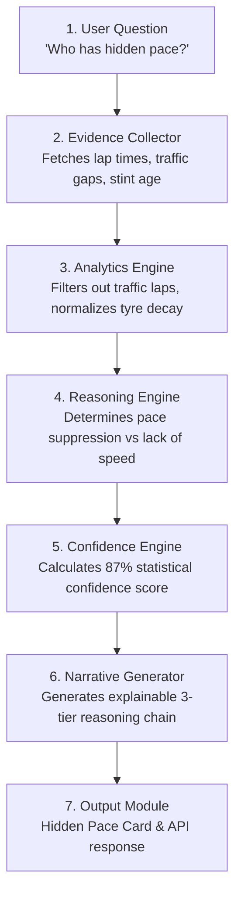

# F1 Insights — Intelligence Implementation Matrix & Engineering Architecture (v2026.7)

> **Engineering Architecture Specification**: This document defines the technical execution pipeline, data schemas, analytics services, explainable reasoning chains, and priority matrix for implementing F1 Insights.

---

## 🏗️ Universal 7-Stage Insight Engine Pipeline

Every insight in F1 Insights—regardless of UI representation—is produced through a single, standardized 7-stage architectural pipeline:



### Stage Responsibilities
1. **User Question**: Input trigger (direct query, scheduled cron, or live event webhook).
2. **Evidence Collector**: Multi-provider data ingestion (`JolpicaProvider`, `TIF1Provider`, `OpenF1Provider`, `OpenMeteoProvider`).
3. **Analytics Engine**: Deterministic processing (filtering, statistical regression, outlier removal).
4. **Reasoning Engine**: LLM / rule-based synthesis evaluating hypotheses against analytical evidence.
5. **Confidence Engine**: Quantitative confidence scoring ($0.0 - 1.0$) based on data freshness and sample size.
6. **Narrative Generator**: Formats output into a 3-tier Explainable Evidence Chain (**Evidence** $\rightarrow$ **Reasoning** $\rightarrow$ **Conclusion**).
7. **Output Module**: Delivers JSON API payloads and renders decoupled UI components.

---

## 🔗 Decoupled 3-Tier Architecture

To keep the system architecture-neutral and maintainable, implementation is strictly separated into three decoupled layers:

```
[DATA SOURCE LAYER]        Jolpica REST │ tif1 HTTP/2 CDN │ OpenF1 Real-time │ OpenMeteo
                                      │
                                      ▼
[ANALYTICS SERVICE LAYER]  StintDecayEngine │ PitLossCalculator │ ClearAirPaceModel
                                      │
                                      ▼
[OUTPUT MODULE LAYER]      StrategyCard │ ExecutiveBriefModule │ TelemetryOverlayModule
```

---

## 🧠 Explainable Evidence Chains (Technical Specification)

Every AI insight generated by the Reasoning Engine must adhere to the 3-tier schema:

```json
{
  "question_id": "AI-EX-01",
  "topic": "Driver Velocity Explanation",
  "confidence_score": 0.88,
  "confidence_label": "High (88%)",
  "evidence": [
    "Sector 2 Split: 36.410s (Purple / Best overall)",
    "Minimum Corner Speed (Turn 4): 184 km/h (+6 km/h over P2)",
    "Throttle Application: Applied 12 meters earlier than teammate"
  ],
  "reasoning": "The McLaren MCL39 exhibits superior rear downforce stability under trail-braking, allowing Norris to rotate the car earlier and pick up full throttle 12m ahead of Verstappen.",
  "conclusion": "Norris holds a genuine 0.18s/lap pace advantage in Sector 2 rather than a low-fuel anomaly."
}
```

---

## 📑 Complete Engineering Backlog Matrix (P0 to P3)

---

### 📅 Section 1: Pre-Weekend Intelligence

| ID | Question | Level | Data Source | Analytics Service | Output Module | Confidence | Complexity | Priority | Dependencies |
| :--- | :--- | :---: | :--- | :--- | :--- | :---: | :---: | :---: | :--- |
| **PRE-01** | *When is the next session & format?* | Level 1 (Observed) | Jolpica API | Schedule Engine | SessionCountdownModule | 100% | XS | **P0** | `✓ Jolpica` |
| **PRE-02** | *Does this circuit suit our car?* | Level 2 (Computed) | tif1 CDN | Circuit Specs Engine | CircuitBlueprintModule | High (90%) | S | **P1** | `✓ tif1` `✓ Circuit DB` |
| **PRE-03** | *Who won here last year?* | Level 1 (Observed) | Jolpica API | Results Aggregator | StandingsModule | 100% | XS | **P2** | `✓ Jolpica` |
| **PRE-04** | *How hard is overtaking here?* | Level 2 (Computed) | Historical DB | Overtake Evaluator | PitStrategyModule | High (92%) | S | **P1** | `✓ Circuit DB` |
| **PRE-05** | *Are drivers taking engine grid penalties?* | Level 1 (Observed) | FIA PDF Scraper | Penalty Aggregator | GridPenaltiesModule | 100% | S | **P0** | `✓ FIA PDFs` |
| **PRE-06** | *Who is at risk of a race ban?* | Level 1 (Observed) | TracingInsights | Penalty Points Watch | PenaltyWatchModule | 100% | XS | **P1** | `✓ TracingInsights` |
| **PRE-07** | *What is the weather forecast?* | Level 1 (Observed) | OpenMeteo API | Weather Pipeline | HeaderModule | High (85%) | S | **P0** | `✓ OpenMeteo` |

---

### 🏎️ Section 2: Free Practice Intelligence

| ID | Question | Level | Data Source | Analytics Service | Output Module | Confidence | Complexity | Priority | Dependencies |
| :--- | :--- | :---: | :--- | :--- | :--- | :---: | :---: | :---: | :--- |
| **FP-01** | *Who has the best single-lap vs race pace?* | Level 2 (Computed) | tif1 CDN | Stint Pace Evaluator | SectorMatrixModule | High (88%) | M | **P0** | `✓ tif1` |
| **FP-02** | *How bad is tyre degradation on long runs?* | Level 2 (Computed) | tif1 CDN | Tyre Deg Simulator | TyreDegModule | High (85%) | M | **P1** | `✓ tif1` |
| **FP-03** | *Is anyone sandbagging on heavy fuel?* | Level 3 (Inference) | OpenF1 API | AI Telemetry Engine | ExecutiveBriefModule | Medium (70%) | L | **P1** | `✓ OpenF1` `✓ AI Engine` |
| **FP-04** | *Who is struggling with setup vs pace?* | Level 3 (Inference) | OpenF1 API | AI Diagnostic Engine | ExecutiveBriefModule | Medium (78%) | L | **P1** | `✓ OpenF1` `✓ AI Engine` |

---

### ⏱️ Section 3: Qualifying Intelligence

| ID | Question | Level | Data Source | Analytics Service | Output Module | Confidence | Complexity | Priority | Dependencies |
| :--- | :--- | :---: | :--- | :--- | :--- | :---: | :---: | :---: | :--- |
| **QUAL-01** | *Who got Pole and what was the gap?* | Level 1 (Observed) | Jolpica / tif1 | Timing Aggregator | SectorMatrixModule | 100% | XS | **P0** | `✓ Jolpica` `✓ tif1` |
| **QUAL-02** | *Who set the best sector splits?* | Level 1 (Observed) | tif1 CDN | Sector Matrix Engine | SectorMatrixModule | 100% | XS | **P0** | `✓ tif1` |
| **QUAL-03** | *Who extracted maximum from qualifying?* | Level 3 (Inference) | Race Results | Overperformance Engine | ExecutiveBriefModule | High (85%) | M | **P1** | `✓ AI Engine` |
| **QUAL-04** | *Were any lap times deleted for track limits?* | Level 1 (Observed) | Race Control `rcm` | Message Parser | GridPenaltiesModule | 100% | XS | **P0** | `✓ rcm.json` |

---

### 🚦 Section 4: Live Race Intelligence

| ID | Question | Level | Data Source | Analytics Service | Output Module | Confidence | Complexity | Priority | Dependencies |
| :--- | :--- | :---: | :--- | :--- | :--- | :---: | :---: | :---: | :--- |
| **RACE-01** | *Is Driver X faster due to tyres or pace?* | Level 3 (Inference) | tif1 CDN | Stint Decay Engine | ExecutiveBriefModule | High (88%) | M | **P0** | `✓ tif1` `✓ AI Engine` |
| **RACE-02** | *Did Team X undercut successfully?* | Level 2 (Computed) | OpenF1 API | Pit Exit Delta Engine | PitStrategyModule | 100% | S | **P0** | `✓ OpenF1` |
| **RACE-03** | *Who has Strategic Advantage right now?* | Level 2 (Computed) | OpenF1 + tif1 | Strategic Index Engine | PitStrategyModule | High (85%) | L | **P0** | `✓ OpenF1` `✓ tif1` |
| **RACE-04** | *If SC comes within 5 laps, who benefits?* | Level 4 (Predictive) | OpenF1 API | Pit Window Engine | PitStrategyModule | High (82%) | L | **P0** | `✓ OpenF1` `✓ AI Engine` |
| **RACE-05** | *Who has hidden pace in traffic?* | Level 3 (Inference) | OpenF1 API | Clear-Air Pace Engine | ExecutiveBriefModule | High (86%) | L | **P1** | `✓ OpenF1` `✓ AI Engine` |

---

### 🏁 Section 5: Post-Race Intelligence

| ID | Question | Level | Data Source | Analytics Service | Output Module | Confidence | Complexity | Priority | Dependencies |
| :--- | :--- | :---: | :--- | :--- | :--- | :---: | :---: | :---: | :--- |
| **POST-01** | *Why did the winner actually win?* | Level 5 (Explanation) | Race Telemetry | AI Debrief Engine | ExecutiveBriefModule | High (92%) | M | **P0** | `✓ AI Engine` |
| **POST-02** | *What was the biggest strategic mistake?* | Level 5 (Explanation) | Race Telemetry | Strategic Misstep Engine | ExecutiveBriefModule | High (88%) | M | **P0** | `✓ AI Engine` |
| **POST-03** | *Was the fastest car actually the winner?* | Level 2 (Computed) | tif1 CDN | True Pace Evaluator | ExecutiveBriefModule | High (95%) | M | **P0** | `✓ tif1` |
| **POST-04** | *What were the 5 key moments of the race?* | Level 5 (Explanation) | Race Log | Key Moment Timeline | ExecutiveBriefModule | High (90%) | S | **P0** | `✓ AI Engine` |

---

## 🎯 Priority Matrix Summary for Engineering Sprints

```
P0 (Core Production Engine):   22 Questions  → Jolpica, tif1 CDN, Basic AI Briefs, Pit Loss Calculator
P1 (High-Value Moat):         18 Questions  → OpenF1 Realtime, Strategic Advantage Index, Hidden Pace, AI Reasoning Chains
P2 (Enhancements):            14 Questions  → Historical Comparisons, OpenMeteo Rain Crossover, Upgrades Tracker
P3 (Long Tail):                8 Questions   → Milestones, Contract Watch, Social Sentiment Scraper
```
