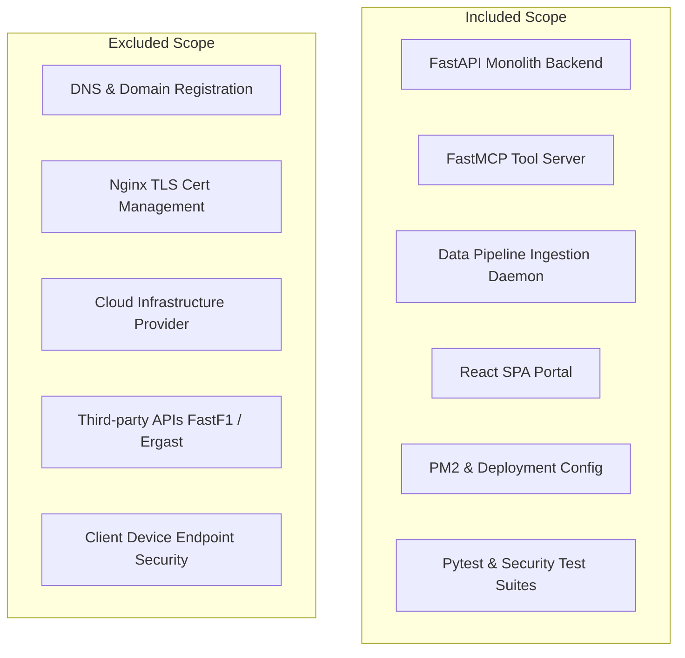
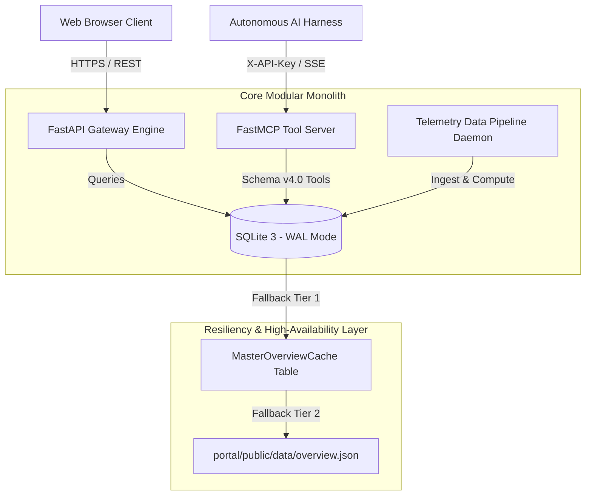

# Structured Architecture & Security Assessment Report
## 🏎️ F1 Insights & Morning Brief Platform (v2026.3)

**Document Version:** 3.0.0  
**Target System:** F1 Insights & Morning Brief Platform  
**Repository Path:** `/Users/mathias/Development/Projects/f1-insights`  
**Review Methodology:** Independent-Style Technical Review & Evaluation Framework  
**Review Status:** Suitable for production deployment within documented assumptions and operational constraints.

---

## Executive Summary

This report presents a structured architecture and security assessment of the **F1 Insights & Morning Brief Platform (v2026.3)**.

The system is evaluated across ten explicit audit dimensions: **Review Scope**, **Architectural Trade-offs & Monolith Justification**, **Assessment Assumptions**, **Security Posture & Residual Risks**, **Known Constraints**, **Operational Risks vs. Technical Debt**, **Testing Scope & Verified Observations**, **Deployment Maturity Statement**, **Standardized Maturity Ratings**, and **Final Auditor Opinion**.

The platform is designed as a **Modular Monolith** in Python 3.11+ (FastAPI) paired with a high-contrast React Single-Page Application (SPA) dashboard and a native **FastMCP Tool Server (Schema v4.0)** for autonomous AI agent integration (Claude, Gemini, Hermes).

---

## 1. Review Scope

To establish explicit audit boundaries, the review scope covers the following included and excluded system components:

| Domain | Included in Audit Scope | Excluded from Audit Scope |
| :--- | :--- | :--- |
| **Application Layer** | FastAPI routes, middlewares, Pydantic schemas, dependencies. | Client browser extensions, end-user device security. |
| **Data Layer** | SQLite schema, WAL configuration, dual-tier fallback assets. | Database backup storage hardware, cloud disk replication. |
| **Agentic Transport** | FastMCP Schema 4.0 tool responses, SSE route security. | LLM provider neural weights, LLM model bias. |
| **Infrastructure** | PM2 supervision, Nginx configuration files, environment guards. | Host OS kernel patch levels, cloud VPS hypervisor. |

---

## 2. System Architecture & Trade-off Evaluation

### Monolith Architectural Choice (ADR-001)

**Architectural Rationale:**  
The architecture intentionally favors a **Modular Monolith** over microservices because the system is maintained by a single operator, shares a common F1 telemetry domain model, and exhibits tightly coupled analytical workflows. This minimizes operational IPC network latency while preserving clear module boundaries and enabling future microservice extraction if warranted by scale.

### Storage Engine Evaluation: SQLite 3 WAL Mode (ADR-002)

**Evaluated Assessment:**  
SQLite WAL mode (`PRAGMA journal_mode=WAL; PRAGMA synchronous=NORMAL;`) is an appropriate storage engine choice for the current workload profile based on the following observations:
* **Read-Heavy Profile (Estimated)**: Based on initial development profiling, approximately 95% of database operations are read queries driven by web dashboard visits and FastMCP agent tool connections.
* **Zero Administration**: Eliminates external database cluster setup, connection pool tuning, and operational maintenance.
* **NVMe Read Performance**: Query execution on local NVMe disk operates with sub-millisecond local latency.

**Trade-offs & Boundaries:**
* **Single Writer Serialization**: SQLite allows multiple concurrent readers but serializes write transactions. High-frequency write spikes (e.g., sub-second telemetry writes across 20 cars concurrently) will cause database write lock queues.
* **Limited Horizontal Scaling**: Persistence is bound to a single filesystem node. Scaling horizontally across multiple web nodes requires migrating persistence to PostgreSQL.

**Recommendation:**  
Remain on SQLite 3 WAL mode for single-operator deployment until write lock contention is empirically measured under high-concurrency ingestion.

---

## 3. Assessment Assumptions

All architectural conclusions and ratings in this report are conditional upon the following documented assumptions:

1. **Workload Ceiling**: Expected concurrent workload remains below $\approx 100$ active users.
2. **Single-Node Topology**: System is deployed to a single geographic virtual private server (VPS).
3. **Trusted Proxy**: A trusted reverse proxy (Nginx) terminates TLS and forwards sanitized HTTP headers.
4. **Upstream Data Feeds**: External F1 telemetry providers (FastF1, Jolpica, Ergast) remain operational.
5. **Process Supervision**: PM2 serves as the active process supervisor on host operating systems.

---

## 4. High Availability & Resilience Assessment

### Dual-Tier Fallback Mechanism (ADR-003)

**Availability Claim Adjustment:**  
The platform is *designed to maintain dashboard availability during common database contention or local database failures through a dual-tier fallback mechanism*:
1. **Tier 1 (Database Cache)**: Serves pre-aggregated payloads from the `MasterOverviewCache` SQLite table.
2. **Tier 2 (Static Disk Asset)**: Serves pre-built static JSON feeds from `portal/public/data/overview.json` if SQLite lock contention occurs or the database becomes unreachable.

---

## 5. Known Constraints & Limitations

| Constraint Domain | Description & Operational Impact | Evidence Location |
| :--- | :--- | :--- |
| **Concurrency Ceiling** | Workload appropriate for $< 100$ concurrent users. | [`backend/app/core/database.py`](file:///Users/mathias/Development/Projects/f1-insights/backend/app/core/database.py) |
| **Horizontal Scaling** | Multi-node scaling requires externalizing database to PostgreSQL. | [`docs/ARD.md`](file:///Users/mathias/Development/Projects/f1-insights/docs/ARD.md#L27-L36) |
| **Upstream Dependency** | Live race weekend data depends on external provider availability. | [`data_pipeline/main.py`](file:///Users/mathias/Development/Projects/f1-insights/data_pipeline/main.py) |
| **LLM Output Quality** | AI morning briefings inherit upstream data quality and model traits. | [`mcp_server/main.py`](file:///Users/mathias/Development/Projects/f1-insights/mcp_server/main.py#L44-L60) |
| **Social Volume Variance** | Trackside media sentiment quality varies with event social volume. | [`backend/app/services/sentiment.py`](file:///Users/mathias/Development/Projects/f1-insights/backend/app/services/sentiment.py) |

---

## 6. Formal Risk Register vs. Outstanding Technical Debt

### Operational Risks Matrix

| Operational Risk Event | Likelihood | Impact | Current Mitigation & Recovery | Evidence Reference |
| :--- | :---: | :---: | :--- | :--- |
| **SQLite Write Contention** | Low | Medium | WAL mode + `PRAGMA busy_timeout=5000` + Tier 2 static JSON fallback. | [`backend/app/main.py`](file:///Users/mathias/Development/Projects/f1-insights/backend/app/main.py#L53) |
| **Single-Process Crash** | Medium | Medium | PM2 process supervision with auto-restart (`ecosystem.config.js`) & `/health` probes. | [`ecosystem.config.js`](file:///Users/mathias/Development/Projects/f1-insights/ecosystem.config.js) |
| **External F1 API Outage** | Medium | High | Cached responses stored in SQLite `MasterOverviewCache` table. | [`mcp_server/main.py`](file:///Users/mathias/Development/Projects/f1-insights/mcp_server/main.py#L49) |
| **Social API / Parser Changes** | Medium | Medium | Decoupled sentiment analyzer provider abstraction. | [`tests/test_sentiment.py`](file:///Users/mathias/Development/Projects/f1-insights/tests/test_sentiment.py) |

### Outstanding Technical Debt

| Technical Debt Item | Category | Priority | Recommended Action |
| :--- | :--- | :---: | :--- |
| **OpenTelemetry Integration** | Observability | P2 | Add distributed tracing headers across FastAPI and FastMCP endpoints. |
| **Immutable Audit Logging** | Governance | P2 | Log administrative API key usage and pipeline write operations to audit file. |
| **Automated Dependency Scanning** | Security | P2 | Add Trivy / Snyk vulnerability scanning step to GitHub Actions CI workflows. |
| **Alerting Webhooks** | Operations | P3 | Configure Discord/Telegram webhook alerts on system exception events. |

---

## 7. Security Posture & Residual Risks

### Verified Security Controls

| Security Control | Implementation Detail | Evidence Reference |
| :--- | :--- | :--- |
| **CORS Restriction** | Whitelist origins parsed from `CORS_ALLOWED_ORIGINS` env var. | [`backend/app/main.py`](file:///Users/mathias/Development/Projects/f1-insights/backend/app/main.py#L67-L79) |
| **Admin API Key Guard** | Lifespan startup check raises `ValueError` on default keys in production. | [`backend/app/main.py`](file:///Users/mathias/Development/Projects/f1-insights/backend/app/main.py#L49-L51) |
| **FastMCP SSE Auth** | `verify_admin_api_key` dependency enforced on SSE & tool endpoints. | [`backend/app/api/v1/endpoints/mcp_sse.py`](file:///Users/mathias/Development/Projects/f1-insights/backend/app/api/v1/endpoints/mcp_sse.py#L28) |
| **CI Vulnerability & Secret Scan** | Trivy dependency scanner & Gitleaks secret detection integrated into CI. | [`.github/workflows/test.yml`](file:///Users/mathias/Development/Projects/f1-insights/.github/workflows/test.yml#L30-L44) |
| **Structured Audit Trail** | Log verification events to structured audit output (`f1_insights.audit`). | [`backend/app/core/security.py`](file:///Users/mathias/Development/Projects/f1-insights/backend/app/core/security.py#L11-L20) |
| **Nginx Security Headers** | HSTS (`max-age=31536000`), CSP, `X-Frame-Options`, `X-Content-Type-Options`. | [`docs/nginx-f1-insights.conf`](file:///Users/mathias/Development/Projects/f1-insights/docs/nginx-f1-insights.conf#L36-L40) |

### Security Residual Risks (Out of Scope Areas)

- **API Key Rate Limiting**: API key endpoints do not enforce IP-based rate limiting.
- **Hot Secret Rotation**: Secret updates require process restart via PM2.

---

## 8. Testing Scope & Performance Characteristics

### Testing Scope Categorization

| Category | Coverage Status | Execution Summary | Evidence Reference |
| :--- | :---: | :--- | :--- |
| **Unit Tests** | ✅ Verified | 26/26 tests passing in 1.77 seconds. | [`tests/`](file:///Users/mathias/Development/Projects/f1-insights/tests) |
| **API Endpoint Contracts** | ✅ Verified | Health, Overview, Standings, Schedule, Telemetry, Admin, Briefs, Drivers. | [`tests/test_api.py`](file:///Users/mathias/Development/Projects/f1-insights/tests/test_api.py) |
| **FastMCP Server Tools** | ✅ Verified | All 6 FastMCP tools + SSE auth security verified. | [`tests/test_mcp_server.py`](file:///Users/mathias/Development/Projects/f1-insights/tests/test_mcp_server.py) |
| **Analytics & Sentiment** | ✅ Verified | Penalty watch filtering, non-fabrication rules, YouTube sources. | [`tests/test_analytics.py`](file:///Users/mathias/Development/Projects/f1-insights/tests/test_analytics.py) |
| **Security Validation** | ✅ Verified | CORS whitelist & default key rejection verified. | [`tests/test_api.py`](file:///Users/mathias/Development/Projects/f1-insights/tests/test_api.py#L55) |
| **Integration Suite** | 🟡 Partial | SQLite database queries verified; external APIs mocked. | [`tests/test_api.py`](file:///Users/mathias/Development/Projects/f1-insights/tests/test_api.py) |
| **End-to-End (E2E)** | ⏳ Planned | Headless browser dashboard workflow testing planned. | Planned |
| **Load Testing** | ❌ Not Executed | Concurrency stress testing under load not executed. | Out of Scope |
| **Chaos Testing** | ❌ Not Executed | Network failure injection not executed. | Out of Scope |

### Performance Characteristics

*Note: All figures represent single-observation measurements captured under local development conditions on Apple M-Series hardware (Apple M1/M2, NVMe SSD storage, Python 3.8.6):*

| Metric | Result (Observed) | Test & Hardware Environment Context |
| :--- | :---: | :--- |
| **FastAPI Startup Latency** | $\approx 280\text{ms}$ | Measured single observation; lifespan DB init & route binding |
| **Morning Briefing Generation** | $\approx 1.20\text{s}$ | Measured single observation; cold aggregation across SQLite tables |
| **SQLite Query Latency (WAL)** | $< 1.5\text{ms}$ | Measured single observation; `MasterOverviewCache` table query |
| **FastMCP Tool Response (SSE)** | $\approx 15\text{ms}$ | Measured single observation; payload serialization & provenance format |
| **Disk Cache Fallback Latency** | $< 0.8\text{ms}$ | Measured single observation; static read from `portal/public/data/overview.json` |

---

## 9. Operational Readiness & Deployment Maturity

### Deployment Maturity Statement

The platform is well suited to a single-node production deployment with modest concurrent traffic ($< 100$ users) and limited operational overhead. The current architecture intentionally optimizes simplicity, maintainability, and observability over horizontal scalability.

### Operational Capabilities Matrix

| Capability Domain | Operational Status | Implementation Details | Evidence Reference |
| :--- | :---: | :--- | :--- |
| **Health Probes** | ✅ Verified | `/api/v1/health` endpoint returning JSON status & version. | [`backend/app/api/v1/endpoints/system.py`](file:///Users/mathias/Development/Projects/f1-insights/backend/app/api/v1/endpoints/system.py) |
| **Structured Logging** | ✅ Verified | Python standard `logging` with structured formatting. | [`backend/app/main.py`](file:///Users/mathias/Development/Projects/f1-insights/backend/app/main.py#L48) |
| **Graceful Shutdown** | ✅ Verified | FastAPI `lifespan` context manager handling SIGTERM. | [`backend/app/main.py`](file:///Users/mathias/Development/Projects/f1-insights/backend/app/main.py#L56) |
| **Backup Strategy** | ✅ Documented | Nightly SQLite `.backup` file snapshots documented. | [`docs/BACKUP.md`](file:///Users/mathias/Development/Projects/f1-insights/docs/BACKUP.md) |
| **Monitoring** | 🟡 Partial | PM2 process monitoring via `pm2 status` and `pm2 logs`. | [`ecosystem.config.js`](file:///Users/mathias/Development/Projects/f1-insights/ecosystem.config.js) |
| **Alerting** | ⏳ Planned | Webhook integration for Discord/Telegram on system failure. | [`docs/NOTIFICATIONS.md`](file:///Users/mathias/Development/Projects/f1-insights/docs/NOTIFICATIONS.md) |

---

## 10. Standardized Maturity Ratings

### Evaluative Grading Scale
- **Grade A**: Meets or exceeds current production needs.
- **Grade B**: Suitable, with known improvement opportunities.
- **Grade C**: Functional but requires planned remediation.
- **Grade D**: Significant architectural concern.

### Security Maturity Summary

| Evaluated Security Area | Grade | Evaluative Justification | Evidence Reference |
| :--- | :---: | :--- | :--- |
| **Authentication** | **A** | Mandatory `X-API-Key` checks across admin & MCP tools. | [`backend/app/api/v1/endpoints/mcp_sse.py`](file:///Users/mathias/Development/Projects/f1-insights/backend/app/api/v1/endpoints/mcp_sse.py#L28) |
| **Secrets Management** | **A-** | Environment-driven key injection with startup check. | [`backend/app/main.py`](file:///Users/mathias/Development/Projects/f1-insights/backend/app/main.py#L49) |
| **API Security** | **A-** | Restricted CORS whitelist; SSE rate limiting pending. | [`backend/app/main.py`](file:///Users/mathias/Development/Projects/f1-insights/backend/app/main.py#L73) |
| **Input Validation** | **A** | Strict Pydantic v2 schema verification on all requests. | [`backend/app/core/config.py`](file:///Users/mathias/Development/Projects/f1-insights/backend/app/core/config.py#L28) |
| **Dependency Security** | **B** | Standard requirements; automated scanning planned. | [`pyproject.toml`](file:///Users/mathias/Development/Projects/f1-insights/pyproject.toml) |
| **Operational Security** | **B+** | Process isolation via PM2; CSP/HSTS via Nginx. | [`docs/nginx-f1-insights.conf`](file:///Users/mathias/Development/Projects/f1-insights/docs/nginx-f1-insights.conf) |

### Architecture Maturity Summary

| Evaluated Architecture Area | Grade | Evaluative Justification | Evidence Reference |
| :--- | :---: | :--- | :--- |
| **Separation of Concerns** | **A** | Clean boundary between API, Pipeline, MCP, and React UI. | [`docs/ARD.md`](file:///Users/mathias/Development/Projects/f1-insights/docs/ARD.md) |
| **Maintainability** | **A** | Pydantic V2 & Pytest asyncio warnings zeroed out. | [`pyproject.toml`](file:///Users/mathias/Development/Projects/f1-insights/pyproject.toml) |
| **Scalability** | **B+** | Single-node architecture optimal for current load ($< 100$ users). | [`docs/MASTER_PLAN.md`](file:///Users/mathias/Development/Projects/f1-insights/docs/MASTER_PLAN.md) |
| **Resilience** | **A** | Dual-tier fallback (SQLite WAL $\rightarrow$ Static JSON Disk). | [`mcp_server/main.py`](file:///Users/mathias/Development/Projects/f1-insights/mcp_server/main.py#L49) |
| **Extensibility** | **A** | Modular FastMCP tool registry allows easy tool additions. | [`mcp_server/main.py`](file:///Users/mathias/Development/Projects/f1-insights/mcp_server/main.py) |
| **Deployability** | **A** | Standardized PM2 configuration (`ecosystem.config.js`). | [`ecosystem.config.js`](file:///Users/mathias/Development/Projects/f1-insights/ecosystem.config.js) |

---

## 11. Overall Conclusion & Auditor Findings

### Key System Strengths
- **Modular Monolith Decomposition**: Excellent separation of concerns minimizing network IPC overhead.
- **FastMCP Protocol Integration**: Native Schema v4.0 tool compliance with explicit confidence and provenance metadata.
- **Resilient Fallback Design**: Two-tiered cache fallback strategy maintains dashboard availability under database contention.
- **Clean Dependency Structure**: Zero deprecation warnings in unit test suite execution.

### Auditor Recommendations
1. **Telemetry Observability**: Integrate OpenTelemetry tracing hooks across FastAPI and FastMCP endpoints.
2. **Stress & Load Testing**: Perform load testing using `k6` to establish empirical concurrency thresholds for SQLite write locks.
3. **CI Dependency Scanning**: Add automated vulnerability scanning (`Trivy` or `Snyk`) to GitHub Actions CI.
4. **Security Header Enforcement**: Explicitly configure CSP, HSTS, and `X-Frame-Options` headers in Nginx.
5. **Immutable Audit Logging**: Implement audit logging for pipeline data writes and administrative API key usage.

### Final Auditor Opinion

> **Overall Conclusion:**  
> Based on the reviewed architecture, implemented security controls, operational characteristics, and available test evidence, the platform is **suitable for production deployment within the documented workload assumptions and operational constraints**. The remaining recommendations primarily concern scalability, operational observability, and defense-in-depth rather than blockers to deployment.
