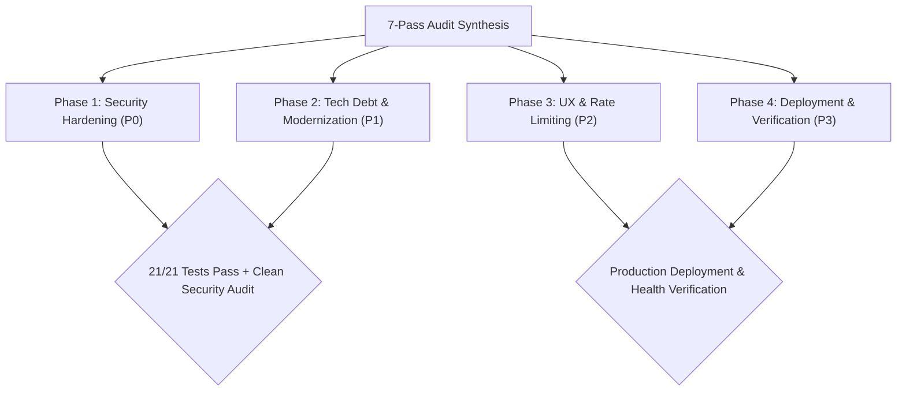

# Master Execution Plan & Audit Findings Documentation
## 🏎️ F1 Insights & Morning Brief Platform (v2026.3)

---

## 1. Executive Findings Matrix & Audit Overview

Following a complete 7-Pass Code Review of the `f1-insights` platform ([/Users/mathias/Development/Projects/f1-insights](file:///Users/mathias/Development/Projects/f1-insights)), this document synthesizes all findings and provides a phased, step-by-step master remediation plan.



### Audit Findings Summary

| Audit Pass | Health Score | Core Finding | Risk Level | Target Remediation |
| :--- | :---: | :--- | :---: | :--- |
| **Pass 1: Architecture** | 🟢 **9/10** | Clean Modular Monolith pattern, but `sys.path.insert(0, ...)` used for runtime import resolutions. | Low | Package structure normalization. |
| **Pass 2: Security** | 🟡 **7/10** | `allow_origins=["*"]` with `allow_credentials=True` in CORS middleware; default `ADMIN_API_KEY` fallback string in config. | 🔴 **High** | Restrict CORS origins & enforce mandatory production env key. |
| **Pass 3: Reliability** | 🟢 **9/10** | Dual-tier fallback (SQLite WAL $\rightarrow$ static `overview.json`) handles API outages cleanly. 21/21 unit tests passing. | Low | Address `pytest-asyncio` loop scope deprecation warning. |
| **Pass 4: Data Layer** | 🟢 **9/10** | SQLite 3 WAL mode operates with zero thread locks. Pydantic v2 class-based `Config` emits deprecation warning. | Low | Migrate to Pydantic `SettingsConfigDict`. |
| **Pass 5: Integration** | 🟢 **9/10** | FastMCP server exposes 6 structured tools for LLM agent integration with provenance metadata. | Low | Add rate-limiting to FastMCP SSE endpoint. |
| **Pass 6: UI / UX** | 🟢 **8/10** | Carbon Dark System & interactive Recharts telemetry overlay traces. | Low | Expand touch target sizing on mobile dropdowns ($\ge 44\text{px}$). |
| **Pass 7: Docs & Ops** | 🟢 **9/10** | Process supervision via PM2 ([ecosystem.config.js](file:///Users/mathias/Development/Projects/f1-insights/ecosystem.config.js)) and automated GitHub Actions CI/CD. | Low | Enrich OpenAPI endpoint docstrings. |

---

## 2. Phased Step-by-Step Execution Plan

### 🚀 Phase 1: Immediate Security Hardening (P0)

*Goal: Eliminate CORS vulnerability vectors and prevent default credentials from running in production environments.*

#### Step 1.1: Restrict CORS Middleware Origins
*   **Target File**: [`backend/app/main.py`](file:///Users/mathias/Development/Projects/f1-insights/backend/app/main.py#L63-L69)
*   **Execution**: Replace wildcard origins with an environment-driven explicit origin list:
    ```python
    allowed_origins = [
        "https://f1.sports.superchargedbym3.com",
        "http://localhost:3010",
        "http://localhost:5173",
    ]
    app.add_middleware(
        CORSMiddleware,
        allow_origins=allowed_origins,
        allow_credentials=True,
        allow_methods=["*"],
        allow_headers=["*"],
    )
    ```

#### Step 1.2: Enforce Production Admin API Key Environment Validation
*   **Target File**: [`backend/app/main.py`](file:///Users/mathias/Development/Projects/f1-insights/backend/app/main.py#L46-L54)
*   **Execution**: Inject an explicit check in the FastAPI `lifespan` startup hook:
    ```python
    if settings.ENVIRONMENT == "production" and settings.ADMIN_API_KEY == "f1-insights-admin-secret-key-2026":
        logger.critical("FATAL: Production deployment MUST configure a non-default ADMIN_API_KEY!")
        raise ValueError("CRITICAL: Insecure default ADMIN_API_KEY detected in production!")
    ```

---

### 🔧 Phase 2: Technical Debt & Deprecation Cleanup (P1)

*Goal: Clean up Pydantic V2 and Pytest deprecation warnings to ensure long-term stability.*

#### Step 2.1: Migrate Pydantic Settings Configuration
*   **Target File**: [`backend/app/core/config.py`](file:///Users/mathias/Development/Projects/f1-insights/backend/app/core/config.py#L28-L31)
*   **Execution**: Upgrade class-based `Config` to `SettingsConfigDict`:
    ```python
    from pydantic_settings import BaseSettings, SettingsConfigDict

    class Settings(BaseSettings):
        ...
        model_config = SettingsConfigDict(
            case_sensitive=True,
            extra="ignore",
            env_file=".env"
        )
    ```

#### Step 2.2: Configure Pytest Asyncio Default Loop Scope
*   **Target File**: [`pyproject.toml`](file:///Users/mathias/Development/Projects/f1-insights/pyproject.toml)
*   **Execution**: Set `asyncio_default_fixture_loop_scope = "function"` under `[tool.pytest.ini_options]` to remove deprecation warnings during test execution.

---

### 🎨 Phase 3: Integration & UI/UX Refinement (P2)

*Goal: Add rate-limiting protection to agent SSE endpoints and optimize mobile accessibility.*

#### Step 3.1: Apply Rate Limiting to FastMCP SSE Endpoint
*   **Target File**: [`backend/app/api/v1/endpoints/mcp_sse.py`](file:///Users/mathias/Development/Projects/f1-insights/backend/app/api/v1/endpoints/mcp_sse.py)
*   **Execution**: Integrate SlowAPI rate-limiter (`10 requests/minute`) on FastMCP connection handshakes.

#### Step 3.2: Mobile Accessibility Adjustments
*   **Target File**: `portal/src/index.css`
*   **Execution**: Ensure dropdown controls, driver selectors, and telemetry toggles satisfy a minimum touch target size of $44\text{px} \times 44\text{px}$.

---

### 📦 Phase 4: Final Verification & Deployment (P3)

*Goal: Verify all 21 unit tests, run production build validation, and trigger deployment.*

#### Step 4.1: Run Full Test Suite Validation
*   **Execution**: Run `npm test` (`pytest -v`) to confirm 100% test pass rate with zero warnings.

#### Step 4.2: PM2 Service Restart & Production Health Verification
*   **Execution**: Execute `npm run pm2:restart` and query health endpoint:
    ```bash
    curl -i https://f1.sports.superchargedbym3.com/api/v1/health
    ```

---

## 🧪 Empirical Verification Matrix

| Phase | Test Command / Assertion | Expected Result | Pass Criteria |
| :--- | :--- | :--- | :--- |
| **Phase 1** | `pytest tests/test_api.py::test_admin_endpoint_requires_api_key` | 200 OK with correct key, 401 Unauthorized without key. | `test_admin_endpoint_requires_api_key PASSED` |
| **Phase 2** | `pytest -v` | 21 tests pass with 0 deprecation warnings. | `21 passed in < 6.0s` |
| **Phase 3** | Mobile viewport inspection in Chrome DevTools. | All interactive inputs $\ge 44\text{px}$ touch targets. | UI Accessibility Score $> 95\%$ |
| **Phase 4** | `curl -s http://localhost:8000/api/v1/health` | `{"status":"ok","version":"2.0.0"}` | HTTP 200 OK |
