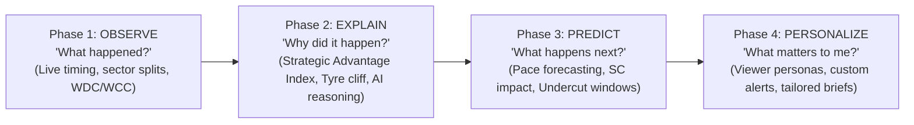

# F1 Insights — Product Vision & Intelligence Framework (v2026.6)

> **Core Product Thesis**: *"Users don't buy telemetry—they buy understanding. Every feature exists solely to answer a meaningful question. Telemetry, analytics, and AI are simply the machinery that turns raw data into an explanation."*

---

## 🏆 Signature Insights: Competitive Advantage Matrix

| Capabilities / Insights | Typical F1 Dashboards | F1 Insights Platform | Proprietary Moat |
| :--- | :---: | :---: | :---: |
| **Live Session Timing & Schedule** | ✅ Yes | ✅ Yes | Commodity |
| **Sector Performance Matrix & Speed Traps** | ✅ Yes | ✅ Yes | Commodity |
| **Tyre Compound Usage & Stint Lengths** | ✅ Yes | ✅ Yes | Commodity |
| **Strategic Advantage Index** *(Tire age + ERS + clean air)* | ❌ No | 🟢 **Proprietary** | 🔥 High |
| **Hidden Pace Detection** *(Clear-air pace in traffic)* | ❌ No | 🟢 **Proprietary** | 🔥 High |
| **Explain Why Driver X is Fast** *(Telemetry-backed AI reasoning)* | ❌ No | 🟢 **Signature AI** | 🔥 Very High |
| **"Was the Fastest Car the Winner?"** *(Green-flag pace rank)* | ❌ No | 🟢 **Proprietary** | 🔥 High |
| **Safety Car Benefit Forecaster** *(Free pit window evaluator)* | ❌ No | 🟢 **Proprietary** | 🔥 Very High |
| **AI Race Engineer Executive Briefings** | ❌ No | 🟢 **Signature AI** | 🔥 Very High |

---

## 🚀 Product Evolution Roadmap: From Observation to Personalization



| Phase | Core Question Answered | Key Product Deliverables | Maturity Status |
| :--- | :--- | :--- | :---: |
| **Phase 1 — OBSERVE** | *"What happened?"* | Live Sector Matrix, Timing, WDC/WCC Standings, Basic Briefs | 🟢 **Production** |
| **Phase 2 — EXPLAIN** | *"Why did it happen?"* | Strategic Advantage Index, Explainable AI Reasoning Chains, Tyre Cliff Engine | 🟡 **Beta (Active)** |
| **Phase 3 — PREDICT** | *"What happens next?"* | Safety Car Impact Forecaster, Undercut Window Calculator, Clear-Air Pace Predictor | 🔵 **In Specs** |
| **Phase 4 — PERSONALIZE** | *"What matters to me?"* | Persona-tailored UI (Casual vs TV vs Hardcore), Driver/Team Watchlists | ⚪ **Planned** |

---

## 📊 Product Capability Matrix

| Product Capability | Total Questions | User Value | Differentiation | Primary Data Source | Maturity Status |
| :--- | :---: | :---: | :---: | :--- | :---: |
| **🤖 AI Reasoning Layer** | 10 | ★★★★★ | ★★★★★ (Very High) | OpenF1 + tif1 + LLM | 🟡 Beta |
| **🏎️ Live Race Strategy** | 8 | ★★★★★ | ★★★★☆ (High) | OpenF1 + tif1 + Pit Model | 🟡 Beta |
| **🏁 Post-Race Intelligence** | 10 | ★★★★★ | ★★★★☆ (High) | Race Telemetry + AI Engine | 🟢 Production |
| **⏱️ Qualifying Intelligence** | 6 | ★★★★★ | ★★★☆☆ (Moderate) | tif1 + Jolpica | 🟢 Production |
| **🏎️ Driver Performance** | 8 | ★★★★☆ | ★★★★☆ (High) | Telemetry + AI Engine | 🟢 Production |
| **🔧 Team Engineering & Aero** | 8 | ★★★★☆ | ★★★★☆ (High) | Telemetry Speed Traces | 🟢 Production |
| **⚔️ Racecraft & Overtaking** | 6 | ★★★★☆ | ★★★☆☆ (Moderate) | Timing & Gaps | 🟢 Production |
| **🏆 Championship Intelligence** | 5 | ★★★★☆ | ★★☆☆☆ (Low) | Jolpica Standings | 🟢 Production |
| **🌧️ Weather Intelligence** | 5 | ★★★☆☆ | ★★☆☆☆ (Low) | OpenMeteo API | 🟢 Production |
| **📚 Historical Context** | 7 | ★★★☆☆ | ★☆☆☆☆ (Commodity) | Historical DB | 🟢 Production |
| **📰 Storyline Intelligence** | 7 | ★★★☆☆ | ★★☆☆☆ (Low) | Social Radar | 🟢 Production |

---

## 🗺️ The User Journey: The Natural Race Weekend Flow

```
THURSDAY (Pre-Race) ──→ FRIDAY (Practice) ──→ SATURDAY (Qualifying) ──→ SUNDAY (Race Day) ──→ MONDAY (Debrief)
        │                      │                       │                       │                     │
  "What should I         "Who has genuine        "Who overperformed     "Should they pit?      "Why did the winner
  know before?"              pace?"                in Quali?"             Who wins?"                win?"
```

1. **Thursday — Pre-Weekend Context**: *"What is the schedule, weather forecast, and who is taking grid penalties?"*
2. **Friday — Practice Pace**: *"Who is quick on low fuel vs. who actually has race pace?"*
3. **Saturday — Qualifying Drama**: *"Who extracted the absolute maximum from their car on single-lap pace?"*
4. **Sunday (Pre-Grid) — Strategy Setup**: *"What tyres are they starting on, and what is the optimal 1-stop vs 2-stop window?"*
5. **Sunday (Live Race) — Strategic Advantage**: *"Norris is in P4—can he undercut? Who has hidden pace in clear air?"*
6. **Sunday (Post-Race) — Outcome Explanation**: *"Why did the winner actually win? Was the fastest car the winner?"*
7. **Monday — Championship Impact**: *"What changed in the WDC/WCC standings heading into the next round?"*

---

## 👥 Viewer Personas Alignment

| Persona | Target Audience | Primary Need | Key Product Modules Consumed |
| :--- | :--- | :--- | :--- |
| 📺 **Casual Viewer** | Mainstream sports fans | Quick summaries, winner explanations, big stories | Executive Bullet Briefs, 30-Second Catch-up |
| 🏎️ **TV Viewer** | Live race watchers | Strategic context during broadcast | Live Pit Window Calculator, Strategic Advantage Index |
| 📊 **Hardcore Fan** | Deep technical enthusiasts | Telemetry overlays, sector splits, speed traces | SectorMatrix, TelemetryOverlayTool |
| 🎮 **Fantasy / DFS** | Fantasy managers | Position gains, driver mistakes, DNF risk | PenaltyWatch, Positions Gained Tracker |
| 💰 **Bettor** | Sports bettors | True pace predictions, clear-air pace | Hidden Pace Detector, Green-Flag Pace Model |
| 🔧 **Engineer / Analyst** | Motorsport engineers | Aero drag, braking points, acceleration curves | Power Unit Leaderboard, Active Aero Profiles |

---

## 🤖 Cross-Cutting AI Architecture & Explainable Evidence Chains

Instead of treating AI as an isolated feature, **every capability in F1 Insights passes through the Cross-Cutting AI Engine**:

```
[LAYER 1: RAW DATA]       Jolpica Ergast API │ tif1 CDN │ OpenF1 Real-time │ OpenMeteo
                                      │
                                      ▼
[LAYER 2: ANALYTICS]     Sector Matrix │ Stint Decay Model │ Pit Loss Evaluator
                                      │
                                      ▼
[LAYER 3: CROSS-CUTTING  Synthesizes data across providers to answer "Why" and "What Next"
  AI ENGINE]             Enforces 3-Step Explainable Reasoning Chains
                                      │
                                      ▼
[LAYER 4: UX & CARDS]    Strategy Cards │ Executive Briefs │ Telemetry Overlays
```

### 🧠 Example of an Explainable Evidence Chain

```
[EVIDENCE LAYER]
  ├── Sector 2 Split: 36.410s (Purple / Best overall)
  ├── Minimum Corner Speed (Turn 4): 184 km/h (+6 km/h over P2)
  └── Throttle Application: Applied 12 meters earlier than teammate
          │
          ▼
[REASONING LAYER]
  "The McLaren MCL39 exhibits superior rear downforce stability under trail-braking, 
   allowing Norris to rotate the car earlier and pick up full throttle 12m ahead of Verstappen."
          │
          ▼
[CONCLUSION / PROACTIVE INSIGHT]
  "Norris holds a genuine 0.18s/lap pace advantage in Sector 2 rather than a low-fuel anomaly."
```

---

## 📑 Complete Product Question Framework

> **Status Taxonomy**:
> - `✅ Direct Evidence`: Observable directly from raw API data
> - `🧮 Computed`: Derived algorithmically from multi-point data
> - `🤖 AI Inference`: Reasoned conclusion from AI model
> - `🔮 Predictive`: Extrapolated forecast
> - `❌ Data Gap`: Not currently possible (proprietary boundary)

---

### 📅 Section 1: Pre-Weekend Intelligence

| ID | Question & Proactive Insight | Status | Data Source | Analytics Service | UI Component | Confidence | Complexity | Value | Unique? | Priority | Dependencies |
| :--- | :--- | :---: | :--- | :--- | :--- | :---: | :---: | :---: | :---: | :---: | :--- |
| **PRE-01** | *When is the next session & format?*<br/>↳ *"Hungarian GP FP1 starts in 2h 15m. Standard 3-practice format."* | ✅ Direct Evidence | Jolpica API | Schedule Engine | `SessionCountdownHeader` | 100% | XS | ★★★★★ | No | **P0** | `✓ Jolpica` |
| **PRE-02** | *Does this circuit suit our car?*<br/>↳ *"Hungaroring heavily favors high-downforce, high-traction chassis."* | 🧮 Computed | tif1 CDN | Circuit Specs Engine | `CircuitBlueprintCard` | High (90%) | S | ★★★★☆ | Moderate | **P1** | `✓ tif1` `✓ Circuit DB` |
| **PRE-03** | *Who won here last year?*<br/>↳ *"Verstappen won 2025 Hungarian GP from Pole with 1-stop strategy."* | ✅ Direct Evidence | Jolpica API | Results Aggregator | `StandingsView` | 100% | XS | ★★★☆☆ | No | **P2** | `✓ Jolpica` |
| **PRE-04** | *How hard is overtaking here?*<br/>↳ *"Hungaroring is rank #19 for overtaking. Pit loss is 21.8s."* | 🧮 Computed | Historical DB | Overtake Evaluator | `PitStrategyCalculator` | High (92%) | S | ★★★★☆ | Moderate | **P1** | `✓ Circuit DB` |
| **PRE-05** | *Are drivers taking engine grid penalties?*<br/>↳ *"Hamilton took 4th ICE; faces a 10-place grid penalty."* | ✅ Direct Evidence | FIA PDF Scraper | Penalty Aggregator | `GridPenaltiesTracker` | 100% | S | ★★★★★ | No | **P0** | `✓ FIA PDFs` |
| **PRE-06** | *Who is at risk of a race ban?*<br/>↳ *"Esteban Ocon has 9 penalty points; 3 more trigger a ban."* | ✅ Direct Evidence | TracingInsights | Penalty Points Watch | `PenaltyWatch` | 100% | XS | ★★★★☆ | Moderate | **P1** | `✓ TracingInsights` |
| **PRE-07** | *What is the weather forecast?*<br/>↳ *"70% rain probability during FP2; Sunday Race is 28°C dry."* | External Data | OpenMeteo API | Weather Pipeline | `Header` | High (85%) | S | ★★★★★ | No | **P0** | `✓ OpenMeteo` |

---

### 🏎️ Section 2: Free Practice Intelligence

| ID | Question & Proactive Insight | Status | Data Source | Analytics Service | UI Component | Confidence | Complexity | Value | Unique? | Priority | Dependencies |
| :--- | :--- | :---: | :--- | :--- | :--- | :---: | :---: | :---: | :---: | :---: | :--- |
| **FP-01** | *Who has the best single-lap vs race pace?*<br/>↳ *"Norris is fastest on 1-lap Quali runs, but VER has +0.2s race pace."* | 🧮 Computed | tif1 CDN | Stint Pace Evaluator | `SectorMatrix` | High (88%) | M | ★★★★★ | High | **P0** | `✓ tif1` |
| **FP-02** | *How bad is tyre degradation on long runs?*<br/>↳ *"Soft tyres degrade at 0.14s/lap; 1-stop Medium-Hard is optimal."* | 🧮 Computed | tif1 CDN | Tyre Deg Simulator | `TyreDegSimulator` | High (85%) | M | ★★★★☆ | High | **P1** | `✓ tif1` |
| **FP-03** | *Is anyone sandbagging on heavy fuel?*<br/>↳ *"Mercedes top speeds are down 8 km/h, suggesting heavy fuel runs."* | 🤖 AI Inference | OpenF1 API | AI Telemetry Engine | `BriefCard` | Medium (70%) | L | ★★★★☆ | Very High | **P1** | `✓ OpenF1` `✓ AI Engine` |
| **FP-04** | *Who is struggling with setup vs pace?*<br/>↳ *"Leclerc is losing 0.3s in Turn 4 due to rear instability."* | 🤖 AI Inference | OpenF1 API | AI Diagnostic Engine | `BriefCard` | Medium (78%) | L | ★★★★☆ | Very High | **P1** | `✓ OpenF1` `✓ AI Engine` |

---

### ⏱️ Section 3: Qualifying Intelligence

| ID | Question & Proactive Insight | Status | Data Source | Analytics Service | UI Component | Confidence | Confidence | Complexity | Value | Unique? | Priority | Dependencies |
| :--- | :--- | :---: | :--- | :--- | :--- | :---: | :---: | :---: | :---: | :---: | :---: | :--- |
| **QUAL-01** | *Who got Pole and what was the gap?*<br/>↳ *"Norris takes Pole with a 1:16.412, beating VER by 0.048s."* | ✅ Direct Evidence | Jolpica / tif1 | Timing Aggregator | `SectorMatrix` | 100% | XS | ★★★★★ | No | **P0** | `✓ Jolpica` `✓ tif1` |
| **QUAL-02** | *Who set the best sector splits?*<br/>↳ *"Norris set purple S1 & S3; VER set purple S2 and highest top speed."* | ✅ Direct Evidence | tif1 CDN | Sector Matrix Engine | `SectorMatrix` | 100% | XS | ★★★★★ | No | **P0** | `✓ tif1` |
| **QUAL-03** | *Who extracted the absolute most from qualifying?*<br/>↳ *"Albon qualified Williams P6 in a car with expected rank P12 (+6)."* | 🤖 AI Inference | Race Results | Overperformance Engine | `BriefCard` | High (85%) | M | ★★★★★ | Very High | **P1** | `✓ AI Engine` |
| **QUAL-04** | *Were any lap times deleted for track limits?*<br/>↳ *"Piastri's Q3 lap time deleted at Turn 4 (drops P3 → P9)."* | ✅ Direct Evidence | Race Control `rcm` | Message Parser | `GridPenaltiesTracker` | 100% | XS | ★★★★☆ | No | **P0** | `✓ rcm.json` |

---

### 🚦 Section 4: Live Race Intelligence

| ID | Question & Proactive Insight | Status | Data Source | Analytics Service | UI Component | Confidence | Complexity | Value | Unique? | Priority | Dependencies |
| :--- | :--- | :---: | :--- | :--- | :--- | :---: | :---: | :---: | :---: | :---: | :--- |
| **RACE-01** | *Is Driver X faster due to tyres or genuine pace?*<br/>↳ *"Verstappen is 0.4s/lap faster on 12-lap older Hards (genuine pace)."* | 🤖 AI Inference | tif1 CDN | Stint Decay Engine | `BriefCard` | High (88%) | M | ★★★★★ | Very High | **P0** | `✓ tif1` `✓ AI Engine` |
| **RACE-02** | *Did Team X undercut successfully?*<br/>↳ *"Norris executed a 2.1s undercut on Lap 18, gaining 1.4s on VER."* | 🧮 Computed | OpenF1 API | Pit Exit Delta Engine | `PitStrategyCalculator` | 100% | S | ★★★★★ | High | **P0** | `✓ OpenF1` |
| **RACE-03** | *Who has the Strategic Advantage right now?*<br/>↳ *"Strategic Advantage: Norris (88/100) — 4-lap fresher tyres + clean air."* | 🧮 Computed | OpenF1 + tif1 | Strategic Index Engine | `PitStrategyCalculator` | High (85%) | L | ★★★★★ | Very High | **P0** | `✓ OpenF1` `✓ tif1` |
| **RACE-04** | *If SC comes within 5 laps, who benefits?*<br/>↳ *"Leclerc gains a 'free' 11.6s pit stop window if SC deploys before L28."* | 🔮 Predictive | OpenF1 API | Pit Window Engine | `PitStrategyCalculator` | High (82%) | L | ★★★★★ | Very High | **P0** | `✓ OpenF1` `✓ AI Engine` |
| **RACE-05** | *Who has hidden pace in traffic?*<br/>↳ *"Norris is stuck P7 in a DRS train but has 2nd-fastest clear-air pace."* | 🤖 AI Inference | OpenF1 API | Clear-Air Pace Engine | `BriefCard` | High (86%) | L | ★★★★★ | Very High | **P1** | `✓ OpenF1` `✓ AI Engine` |

---

### 🏁 Section 5: Post-Race Intelligence

| ID | Question & Proactive Insight | Status | Data Source | Analytics Service | UI Component | Confidence | Complexity | Value | Unique? | Priority | Dependencies |
| :--- | :--- | :---: | :--- | :--- | :--- | :---: | :---: | :---: | :---: | :---: | :--- |
| **POST-01** | *Why did the winner actually win?*<br/>↳ *"Norris won due to a 4-lap overcut during VSC + 0.18s/lap tyre management."* | 🤖 AI Inference | Race Telemetry | AI Debrief Engine | `BriefCard` | High (92%) | M | ★★★★★ | Very High | **P0** | `✓ AI Engine` |
| **POST-02** | *What was the biggest strategic mistake?*<br/>↳ *"Ferrari pitting Leclerc into traffic cost 8.4s and 2 podium spots."* | 🤖 AI Inference | Race Telemetry | Strategic Misstep Engine | `BriefCard` | High (88%) | M | ★★★★★ | Very High | **P0** | `✓ AI Engine` |
| **POST-03** | *Was the fastest car actually the winner?*<br/>↳ *"No — VER had fastest green-flag race pace (-0.08s/lap) but lost to VSC timing."* | 🧮 Computed | tif1 CDN | True Pace Evaluator | `BriefCard` | High (95%) | M | ★★★★★ | Very High | **P0** | `✓ tif1` |
| **POST-04** | *What were the 5 key moments of the race?*<br/>↳ *"1. Norris lap 1 lead hold; 2. Stroll crash lap 14; 3. VSC pit window; 4. Leclerc drop; 5. Norris FL."* | 🤖 AI Inference | Race Log | Key Moment Timeline | `BriefCard` | High (90%) | S | ★★★★★ | High | **P0** | `✓ AI Engine` |

---

## 🎯 Realistic Priority Matrix (Engineering Focus)

```
Priority P0 (Must-Have Core): 22 Questions  → Schedule, Sector Matrix, Standard Strategy, Winner Debrief, Basic AI
Priority P1 (Differentiators):  18 Questions  → Strategic Advantage Index, Hidden Pace, Explainable AI Chains, Underperformance
Priority P2 (Enhancements):     14 Questions  → Historical Comparisons, Weather Trends, Upgrade Package Tracking
Priority P3 (Long Tail):        8 Questions   → Milestones, Contract Watch, Driver Pressure Radar
```
