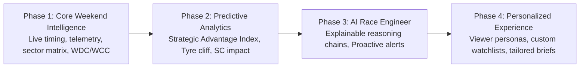

# F1 Insights — Product Specification & AI Reasoning Architecture (v2026.5)

> **Vision**: F1 Insights is an AI-driven Race Engineer and Proactive Intelligence Platform that answers the natural language questions viewers, analysts, and fans ask before, during, and after every Grand Prix weekend.

---

## 🎯 Executive Product Roadmap (Phased Evolution)



### Phase Summary & Target Capabilities
* **Phase 1 — Core Weekend Intelligence (Current - v2026.3)**: Live timing, sector performance matrix, standings, basic briefs, penalty watches (`Jolpica`, `tif1`, `OpenMeteo`).
* **Phase 2 — Predictive Analytics (v2026.4)**: Strategic Advantage Index, undercut window calculator, tyre deg curves, Safety Car impact evaluator, clear-air pace estimator.
* **Phase 3 — AI Race Engineer & Explainable Reasoning (v2026.5)**: Proactive insights, explainable AI reasoning chains (Evidence $\rightarrow$ Reasoning $\rightarrow$ Conclusion), "Why winner won" debriefs.
* **Phase 4 — Personalized Experience (v2027.0)**: Tailored UI views by Viewer Persona (Casual, TV Viewer, Hardcore, Fantasy, Engineer), custom driver alerts.

---

## 👥 Viewer Personas Alignment Matrix

| Persona | Primary Focus & Intent | Target Product Features | Key Questions Asked |
| :--- | :--- | :--- | :--- |
| 📺 **Casual Fan** | Winner, standings, big storylines, easy summaries | Executive Briefs, Catch-up Modals, AI Summaries | *Who won? Who leads the championship?* |
| 🏎️ **TV Viewer** | Live strategy, pit windows, undercut status | Live Pit Window Calculator, Strategic Advantage Index | *Can Norris pit and stay ahead? Is SC helping?* |
| 📊 **Hardcore Fan** | Sector splits, telemetry overlays, lap deltas | SectorMatrix, TelemetryOverlayTool, Speed Traces | *Who has higher minimum corner speed in Turn 4?* |
| 🎮 **Fantasy / DFS** | Position gains, driver mistakes, DNF risks | Positions Gained Tracker, Penalty Watch | *Who is starting out of position with top pace?* |
| 💰 **Bettor** | Pace predictions, long-run averages, clear-air pace | Hidden Pace Alerts, Stint Decay Extrapolation | *Who has hidden pace trapped in traffic?* |
| 🔧 **Engineer / Analyst** | Aero efficiency, traction, braking points, PU hierarchy | Power Unit Leaderboard, Active Aero Drag Profiles | *Which car accelerates best out of slow corners?* |

---

## 📡 Data Freshness & Provider Architecture

| Data Source | Provider Name | Update Frequency | Data Content Exposed | Cost / Rate Limit |
| :--- | :--- | :--- | :--- | :--- |
| **Jolpica API** | `JolpicaProvider` | Post-Session / 1 hr | Schedule, WDC/WCC standings, race results | Free (REST) |
| **tif1 CDN** | `TIF1Provider` | Live / On-Demand | Laps, sector splits, speed trap, per-lap telemetry | Free (HTTP/2 CDN) |
| **OpenF1 API** | `OpenF1Provider` | Real-Time (3.7 Hz) | Live car telemetry, GPS coordinates, live position | Free (Historical) / Paid (Live) |
| **OpenMeteo API** | `OpenMeteoProvider` | 10 Minutes | Circuit weather forecast (air/track temp, rain, wind) | Free (REST) |
| **Social Radar** | `SocialProvider` | 15 Minutes | X & YouTube trackside media sentiment | Free (Internal Scraper) |
| **FIA Documents** | `FIADocScraper` | Event / Static | Official steward decisions, power unit component limits | Free (PDF Parser) |
| **AI Engine** | `AIBriefEngine` | On-Demand / Triggered | Natural language reasoning, explanations, predictions | OpenAI / Anthropic Token API |

---

## 🗓️ Master Product Backlog by Weekend Timeline

---

### 📅 Section 1: Pre-Weekend Intelligence (Mid-Week to Thursday)

| ID | Question | Proactive Insight Example | Type | Evidence | Confidence | Complexity | Value | Unique? | Priority | Dependencies |
| :--- | :--- | :--- | :---: | :--- | :---: | :---: | :---: | :---: | :---: | :--- |
| **PRE-01** | *When is the next session & format?* | *"Hungarian GP FP1 starts in 2h 15m. Standard 3-practice format."* | Fact | Schedule Data | 100% | XS | ★★★★★ | No | **P0** | `✓ Jolpica` |
| **PRE-02** | *Does this circuit suit our car?* | *"Hungaroring heavily favors high-downforce, high-traction chassis (McLaren/Ferrari)."* | Computed | Circuit Specs | High (90%) | S | ★★★★☆ | Moderate | **P1** | `✓ tif1` `✓ Circuit DB` |
| **PRE-03** | *Who won here last year?* | *"Verstappen won 2025 Hungarian GP from Pole with 1-stop Medium-Hard strategy."* | Fact | Historical Race | 100% | XS | ★★★☆☆ | No | **P2** | `✓ Jolpica` |
| **PRE-04** | *How hard is overtaking here?* | *"Hungaroring is rank #19 for overtaking. Pit loss is 21.8s. Qualifying rank is critical."* | Computed | Historical Data | High (92%) | S | ★★★★☆ | Moderate | **P1** | `✓ Circuit DB` |
| **PRE-05** | *What is the Safety Car probability?* | *"Safety Car probability is 65% based on last 10 races (average 1.2 SC deployments)."* | Computed | Historical SC Data | Medium (75%) | S | ★★★☆☆ | Moderate | **P2** | `✓ Historical DB` |
| **PRE-06** | *Which tyre compounds did Pirelli select?* | *"Pirelli selected C3-C4-C5 (softest range). Soft tyres will suffer graining in FP2."* | Fact | Pirelli Selection | 100% | XS | ★★★★☆ | No | **P1** | `✓ tif1` |
| **PRE-07** | *What is the weather forecast per session?* | *"70% rain probability during FP2; Sunday Race forecast is 28°C dry & sunny."* | External Data | Weather API | High (85%) | S | ★★★★★ | No | **P0** | `✓ OpenMeteo` |
| **PRE-08** | *Are drivers taking engine grid penalties?* | *"Hamilton took 4th ICE; faces a 10-place grid penalty on Sunday."* | Fact | FIA Documents | 100% | S | ★★★★★ | No | **P0** | `✓ FIA PDFs` |
| **PRE-09** | *Who is at risk of a race ban?* | *"Esteban Ocon has 9 penalty points; 3 more points before September trigger a ban."* | Fact | FIA Penalty Log | 100% | XS | ★★★★☆ | Moderate | **P1** | `✓ Penalty Log` |
| **PRE-10** | *What is the championship clinch math?* | *"Verstappen clinches WDC if he finishes P3 or higher, regardless of Norris."* | Computed | Standings Points | 100% | S | ★★★★★ | Moderate | **P0** | `✓ Jolpica` |

---

### 🏎️ Section 2: Free Practice Intelligence (Friday–Saturday Morning)

| ID | Question | Proactive Insight Example | Type | Evidence | Confidence | Complexity | Value | Unique? | Priority | Dependencies |
| :--- | :--- | :--- | :---: | :--- | :---: | :---: | :---: | :---: | :---: | :--- |
| **FP-01** | *Who has the best single-lap vs race pace?* | *"Norris is fastest on 1-lap Quali runs (+0.12s), but Verstappen has 0.2s/lap race pace advantage."* | Computed | Sector & Laps | High (88%) | M | ★★★★★ | High | **P0** | `✓ tif1` |
| **FP-02** | *How bad is tyre degradation on long runs?* | *"C5 Soft tyres degrade at 0.14s/lap; Mediums are steady at 0.05s/lap. 1-stop Medium-Hard is optimal."* | Computed | Stint Lap Times | High (85%) | M | ★★★★☆ | High | **P1** | `✓ tif1` |
| **FP-03** | *Is anyone sandbagging on heavy fuel?* | *"Mercedes top speeds are 8 km/h down on straights, suggesting heavy fuel runs during FP2."* | AI Inference | Telemetry + Speeds | Medium (70%) | L | ★★★★☆ | Very High | **P1** | `✓ OpenF1` `✓ AI Engine` |
| **FP-04** | *Did anyone trigger a Red Flag / crash?* | *"FP2 Red Flag triggered by Stroll at Turn 11. 14 minutes of track time lost."* | Fact | Race Control | 100% | XS | ★★★☆☆ | No | **P2** | `✓ rcm.json` |
| **FP-05** | *Who is struggling with setup vs car pace?* | *"Leclerc is losing 0.3s in Turn 4 due to rear instability; Hamilton is clean on identical setup."* | AI Inference | Telemetry Traces | Medium (78%) | L | ★★★★☆ | Very High | **P1** | `✓ OpenF1` `✓ AI Engine` |
| **FP-06** | *Which team improved the most since FP1?* | *"Ferrari gained 0.42s in S2 after adjusting front wing flap angle between FP1 and FP2."* | Computed | Sector Matrix | High (90%) | S | ★★★☆☆ | Moderate | **P2** | `✓ tif1` |

---

### ⏱️ Section 3: Qualifying Intelligence (Saturday)

| ID | Question | Proactive Insight Example | Type | Evidence | Confidence | Complexity | Value | Unique? | Priority | Dependencies |
| :--- | :--- | :--- | :---: | :--- | :---: | :---: | :---: | :---: | :---: | :--- |
| **QUAL-01** | *Who got Pole and what was the gap?* | *"Norris takes Pole Position with a 1:16.412, beating Verstappen by 0.048s."* | Fact | Timing Data | 100% | XS | ★★★★★ | No | **P0** | `✓ Jolpica` `✓ tif1` |
| **QUAL-02** | *Who set the best S1, S2, S3 splits & speed trap?* | *"Norris set purple S1 & S3; Verstappen set purple S2 and highest speed trap (338.4 km/h)."* | Fact | Sector Times | 100% | XS | ★★★★★ | No | **P0** | `✓ tif1` |
| **QUAL-03** | *What is the gap between teammates?* | *"Norris out-qualified Piastri by 0.185s (4-0 head-to-head streak)."* | Computed | Sector Times | 100% | S | ★★★★☆ | No | **P1** | `✓ Jolpica` |
| **QUAL-04** | *Who extracted the absolute most from qualifying?* | *"Albon qualified Williams P6 in a car with expected rank P12 (+6 positions overperformance)."* | AI Inference | Car Rank vs Grid | High (85%) | M | ★★★★★ | Very High | **P1** | `✓ AI Engine` |
| **QUAL-05** | *Were any lap times deleted for track limits?* | *"Piastri's Q3 lap time deleted for exceeding track limits at Turn 4 (drops P3 → P9)."* | Fact | Race Control | 100% | XS | ★★★★☆ | No | **P1** | `✓ rcm.json` |
| **QUAL-06** | *Are there pending steward investigations?* | *"Russell under investigation for impeding Leclerc at Turn 10; decision pending."* | Fact | Race Control | 100% | S | ★★★★☆ | No | **P1** | `✓ rcm.json` |

---

### 🚦 Section 4: Live Race Intelligence (Sunday)

| ID | Question | Proactive Insight Example | Type | Evidence | Confidence | Complexity | Value | Unique? | Priority | Dependencies |
| :--- | :--- | :--- | :---: | :--- | :---: | :---: | :---: | :---: | :---: | :--- |
| **RACE-01** | *What tyre is everyone starting on?* | *"Top 8 starting on Mediums; Sainz (P9) and Alonso (P10) starting on Softs."* | Fact | Timing / Grid | 100% | XS | ★★★★★ | No | **P0** | `✓ tif1` |
| **RACE-02** | *Who is faster: fresher tyres or genuine pace?* | *"Verstappen is 0.4s/lap faster on 12-lap older Hards than Leclerc on fresh Mediums (genuine pace)."* | AI Inference | Stint Decay Delta | High (88%) | M | ★★★★★ | Very High | **P0** | `✓ tif1` `✓ AI Engine` |
| **RACE-03** | *Did Team X undercut or overcut successfully?* | *"Norris executed a 2.1s undercut on Lap 18, gaining 1.4s on Verstappen at pit exit."* | Computed | Out-Lap Timings | 100% | S | ★★★★★ | High | **P0** | `✓ tif1` |
| **RACE-04** | *Who has the Strategic Advantage right now?* | *"Strategic Advantage: Norris (88/100) — 4-lap fresher tyres, 12% more battery, clean air."* | Computed | Strategic Index | High (85%) | L | ★★★★★ | Very High | **P0** | `✓ OpenF1` `✓ tif1` |
| **RACE-05** | *If Safety Car comes within 5 laps, who benefits?* | *"Leclerc benefits most from an SC in laps 22-27 — gains a 'free' 11.6s pit stop window."* | Prediction | Pit Window Model | High (82%) | L | ★★★★★ | Very High | **P0** | `✓ OpenF1` `✓ AI Engine` |
| **RACE-06** | *Who has hidden pace trapped in traffic?* | *"Norris is stuck P7 in a DRS train but has 2nd-fastest clear-air pace capability (+0.4s/lap)."* | AI Inference | Clear-Air Delta | High (86%) | L | ★★★★★ | Very High | **P1** | `✓ OpenF1` `✓ AI Engine` |
| **RACE-07** | *Is a DRS train forming?* | *"DRS train forming behind Albon (P6) spanning P6 to P11 — overtaking probability drops to 12%."* | Computed | Gaps Data | High (92%) | M | ★★★★☆ | High | **P1** | `✓ OpenF1` |
| **RACE-08** | *Who holds the Fastest Lap bonus point?* | *"Fastest Lap: Hamilton (1:18.420) on Lap 44 (currently holds +1 point)."* | Fact | Timing Data | 100% | XS | ★★★★☆ | No | **P0** | `✓ Jolpica` |

---

### 🏁 Section 5: Post-Race Intelligence (Beyond Finishing Order)

| ID | Question | Proactive Insight Example | Type | Evidence | Confidence | Complexity | Value | Unique? | Priority | Dependencies |
| :--- | :--- | :--- | :---: | :--- | :---: | :---: | :---: | :---: | :---: | :--- |
| **POST-01** | *Why did the winner actually win?* | *"Norris won due to a 4-lap overcut during VSC + 0.18s/lap superior tyre management on Hard tyres."* | AI Inference | Race Telemetry | High (92%) | M | ★★★★★ | Very High | **P0** | `✓ AI Engine` |
| **POST-02** | *What was the biggest strategic mistake?* | *"Ferrari pitting Leclerc on Lap 24 into heavy traffic cost 8.4 seconds and 2 podium positions."* | AI Inference | Pit Exit Gaps | High (88%) | M | ★★★★★ | Very High | **P0** | `✓ AI Engine` |
| **POST-03** | *Was the fastest car actually the winner?* | *"No — Verstappen had the fastest green-flag race pace (-0.08s/lap) but lost to Norris on VSC pit timing."* | Computed | Green-Flag Pace | High (95%) | M | ★★★★★ | Very High | **P0** | `✓ tif1` |
| **POST-04** | *Data-driven Driver of the Day* | *"Data Driver of the Day: Albon — P12 → P6 (+6 positions), 0 track limit strikes, 99.2% stint consistency."* | Computed | Composite Index | High (90%) | M | ★★★★☆ | High | **P1** | `✓ Pipeline` |
| **POST-05** | *Who was the hidden hero / biggest loser?* | *"Hidden Hero: Piastri (P5 pace ruined by Lap 1 wing damage); Biggest Loser: Leclerc (-4 positions)."* | AI Inference | Pace vs Finish | High (85%) | M | ★★★★☆ | High | **P1** | `✓ AI Engine` |
| **POST-06** | *What were the 5 key moments of the race?* | *"1. Norris lap 1 lead hold; 2. Stroll crash lap 14; 3. VSC pit window lap 18; 4. Leclerc drop; 5. Norris FL."* | AI Inference | Timeline Analysis | High (90%) | S | ★★★★★ | High | **P0** | `✓ AI Engine` |

---

### 🧠 Section 6: AI Reasoning Layer (Split by Explain / Predict / Summarize)

---

#### 💡 6A. AI Explain Capabilities

| ID | Question | Proactive Insight Example | Type | Evidence | Confidence | Complexity | Value | Unique? | Priority | Dependencies |
| :--- | :--- | :--- | :---: | :--- | :---: | :---: | :---: | :---: | :---: | :--- |
| **AI-EX-01** | *Explain why Driver X is fast.* | *"Norris is fast because he is applying throttle 12m earlier out of Turn 4 due to superior rear downforce."* | AI Inference | Telemetry Traces | High (88%) | L | ★★★★★ | Very High | **P0** | `✓ OpenF1` `✓ AI Engine` |
| **AI-EX-02** | *Explain why Ferrari is struggling.* | *"Ferrari is struggling because high track temps (42°C) are causing thermal degradation on their Soft tyres."* | AI Inference | Temp vs Pace | High (85%) | L | ★★★★★ | Very High | **P0** | `✓ Weather` `✓ AI Engine` |
| **AI-EX-03** | *Explain why the upgrade package worked/failed.* | *"McLaren floor upgrade generated +4% downforce in high-speed S2 without adding straightaway drag."* | AI Inference | Sector Deltas | Medium (78%) | L | ★★★★☆ | Very High | **P1** | `✓ tif1` `✓ AI Engine` |

#### 🔮 6B. AI Predict Capabilities

| ID | Question | Proactive Insight Example | Type | Evidence | Confidence | Complexity | Value | Unique? | Priority | Dependencies |
| :--- | :--- | :--- | :---: | :--- | :---: | :---: | :---: | :---: | :---: | :--- |
| **AI-PR-01** | *Who wins if the race stays green?* | *"Predictive model: Norris wins with 78% probability based on current 0.15s/lap tyre deg advantage."* | Prediction | Pace Extrapolation | Medium (78%) | L | ★★★★★ | Very High | **P0** | `✓ AI Engine` |
| **AI-PR-02** | *Who benefits from a Safety Car in next 5 laps?* | *"Leclerc and Hamilton gain a 'free' 11.6s pit window if SC deploys before Lap 28."* | Prediction | Pit Loss Model | High (85%) | M | ★★★★★ | Very High | **P0** | `✓ OpenF1` `✓ AI Engine` |
| **AI-PR-03** | *Which drivers can realistically 1-stop?* | *"Norris & Verstappen can 1-stop; Ferrari must 2-stop due to high rear tyre degradation slope."* | Prediction | Tyre Cliff Model | High (82%) | M | ★★★★☆ | High | **P1** | `✓ tif1` `✓ AI Engine` |

#### 📝 6C. AI Summarize Capabilities

| ID | Question | Proactive Insight Example | Type | Evidence | Confidence | Complexity | Value | Unique? | Priority | Dependencies |
| :--- | :--- | :--- | :---: | :--- | :---: | :---: | :---: | :---: | :---: | :--- |
| **AI-SU-01** | *Summarize qualifying in three bullet points.* | *"1. Norris takes Pole by 0.048s; 2. Red Bull strong in S2; 3. Hamilton faces 10-place grid drop."* | AI Inference | Event Logs | 100% | S | ★★★★★ | High | **P0** | `✓ AI Engine` |
| **AI-SU-02** | *What should I know if I only watch final 15 laps?* | *"30-Second Catch-up: Norris leads Verstappen by 3.2s on 4-lap fresher Hards; Leclerc P3 on dying Softs."* | AI Inference | Live Race Log | High (95%) | S | ★★★★★ | Very High | **P0** | `✓ AI Engine` |
| **AI-SU-03** | *3 biggest stories before the race?* | *"1. Norris vs VER front row battle; 2. Rain threat at Lap 20; 3. Hamilton grid drop recovery."* | AI Inference | Pre-Race Brief | High (90%) | S | ★★★★★ | High | **P0** | `✓ AI Engine` |

---

## 🔗 Explainable Reasoning Chains Architecture

To make AI insights transparent and trustworthy, every AI output generates an **Explainable Reasoning Chain**:

```
[EVIDENCE LAYER]
  ├── Sector 1 Split: 28.142s (Purple / Best overall)
  ├── Minimum Corner Speed (Turn 4): 184 km/h (+6 km/h over P2)
  └── Throttle Application Distance: 12 meters earlier than teammate
          │
          ▼
[REASONING LAYER]
  "The McLaren MCL39 exhibits superior rear downforce stability under trail-braking, 
   allowing Norris to rotate the car earlier and pick up full throttle 12m ahead of Verstappen."
          │
          ▼
[CONCLUSION / PROACTIVE INSIGHT]
  "Norris holds a genuine 0.18s/lap pace advantage in S1 rather than a low-fuel anomaly."
```

---

## 🛠️ Updated Data Provider & Feature Matrix

| Feature | Primary Data Provider | Secondary / Fallback Provider | Local Component |
| :--- | :--- | :--- | :--- |
| **Live Timing & Schedule** | Jolpica Ergast API | Hardcoded 2026 Calendar | `SessionCountdownHeader.jsx` |
| **Sector Performance Matrix** | `tif1` CDN (Fastest Laps) | TracingInsights local JSON | `SectorMatrix.jsx` |
| **Telemetry Speed & Throttle Overlay** | `OpenF1` Real-time API | `tif1` CDN | `TelemetryOverlayTool.jsx` |
| **Circuit Weather & Forecast** | OpenMeteo API | TracingInsights session weather | `Header.jsx` |
| **Penalty Watch & Track Limits** | TracingInsights `rcm.json` | FIA Document PDFs | `GridPenaltiesTracker.jsx` |
| **Strategic Advantage Index** | `OpenF1` + `tif1` | Computed Stint Deg Model | `PitStrategyCalculator.jsx` |
| **AI Reasoning & Briefs** | AIBriefEngine (LLM) | Static Rule-Based Fallbacks | `BriefCard.jsx` |
