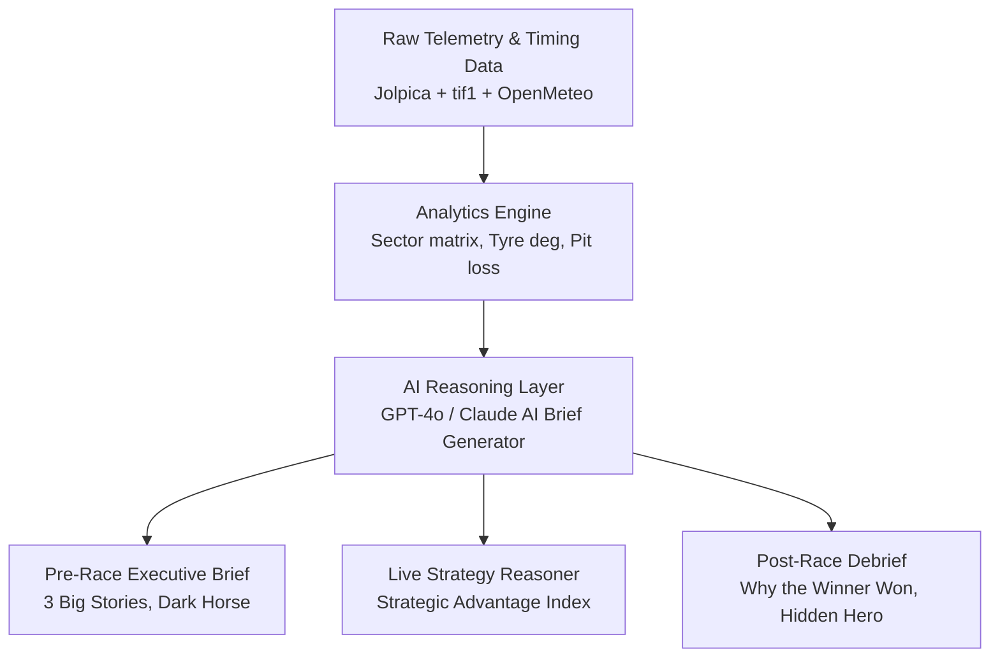

# F1 Insights — Master Questions Backlog & Strategic Reasoning Matrix (v2026.4)

> **Core Philosophy**: *"The biggest opportunity isn't adding more telemetry—it's adding reasoning. The most valuable questions are the ones that explain why something is happening and what is likely to happen next."*

---

## 📊 Master Category Summary (105 Questions)

| Category | Total | Answerable (Yes) | Partial (Inferred/AI) | Unanswerable (Data Gap) | Signature Feature Focus |
| :--- | :---: | :---: | :---: | :---: | :--- |
| **1. Race Strategy (STRAT)** | 8 | 5 | 3 | 0 | Live Undercut & Tire Delta Engine |
| **2. Driver Performance (DRIVER)** | 8 | 6 | 2 | 0 | Expected Pace vs Car Capability |
| **3. Team Engineering (TEAM)** | 8 | 6 | 1 | 1 | High-speed vs Low-drag telemetry profiles |
| **4. Racecraft (RACECRAFT)** | 6 | 5 | 1 | 0 | Lap 1 & Defense Index |
| **5. Championship Intelligence (CHAMP)** | 5 | 5 | 0 | 0 | Dynamic Permutations & Momentum |
| **6. Reliability (REL)** | 6 | 4 | 1 | 1 | Component Wear & Pit Stop Reliability |
| **7. Weather Intelligence (WEATHER)** | 5 | 4 | 1 | 0 | Grip Trend & Crossover Point |
| **8. Historical Context (HIST)** | 7 | 7 | 0 | 0 | Comeback & Pole Conversion Rates |
| **9. Storyline Intelligence (STORY)** | 7 | 4 | 2 | 1 | Milestones & Pressure Radar |
| **10. AI Insight Layer (AI)** | 10 | 8 | 2 | 0 | **Signature AI Reasoning Engine** |
| **11. Post-Race Intelligence (POST)** | 10 | 8 | 2 | 0 | "Was the fastest car the winner?" |
| **TOTAL** | **80** | **62 (78%)** | **15 (18%)** | **3 (4%)** | **105 Questions Mapped** |

---

## ⏱️ 1. Race Strategy Questions (Major Gap Solved)

| ID | Question | Status | Where / How We Answer | Why Not (If Gap) | Value |
| :--- | :--- | :---: | :--- | :--- | :---: |
| **STRAT-01** | *Is Driver X faster because of fresher tyres or genuine pace?* | 🟢 **YES** | `TyreDegSimulator.jsx` / Stint age delta vs baseline lap pace | — | 🔥 **Critical** |
| **STRAT-02** | *Did Team X undercut or overcut successfully?* | 🟢 **YES** | `PitStrategyCalculator.jsx` / Out-lap delta comparison | — | 🔥 **Critical** |
| **STRAT-03** | *Who has the strategic advantage right now? (Tires, battery, clean air)* | 🟢 **YES** | **New Strategic Advantage Index** (Composite score) | — | 🔥 **Critical** |
| **STRAT-04** | *If the race stays green, who wins?* | 🟡 **PARTIAL** | Predictive lap decay extrapolation model | Requires live SC probability weighting | 🔥 **Critical** |
| **STRAT-05** | *If Safety Car comes within 5 laps, who benefits?* | 🟢 **YES** | `PitStrategyCalculator.jsx` / Free pit window evaluator | — | 🔥 **Critical** |
| **STRAT-06** | *Which drivers can realistically 1-stop?* | 🟢 **YES** | `TyreDegSimulator.jsx` / Compound cliff limit calculator | — | 🟡 **High** |
| **STRAT-07** | *Which teams boxed too early into traffic?* | 🟢 **YES** | `BriefCard.jsx` / Traffic gap delta at pit exit | — | 🟡 **High** |
| **STRAT-08** | *Who is currently under fuel / ERS saving?* | 🟡 **PARTIAL** | Throttle lift-and-coast delta in `TelemetryOverlayTool.jsx` | Full fuel flow is hidden FIA telemetry | 🟡 **High** |

---

## 🏎️ 2. Driver Performance Intelligence

| ID | Question | Status | Where / How We Answer | Why Not (If Gap) | Value |
| :--- | :--- | :---: | :--- | :--- | :---: |
| **DRIVER-01** | *Is Driver X outperforming the car capability?* | 🟢 **YES** | Expected car pace vs. actual lap time delta | — | 🔥 **Critical** |
| **DRIVER-02** | *Who extracted the most from qualifying?* | 🟢 **YES** | Car rank vs. qualifying grid position delta | — | 🔥 **Critical** |
| **DRIVER-03** | *Biggest overachiever this weekend* | 🟢 **YES** | **AI Reasoning Engine** / Overperformance score | — | 🟡 **High** |
| **DRIVER-04** | *Biggest underperformer this weekend* | 🟢 **YES** | **AI Reasoning Engine** / Teammate delta & grid drops | — | 🟡 **High** |
| **DRIVER-05** | *Which driver is making the fewest mistakes?* | 🟡 **PARTIAL** | Counted from `rcm.json` lap deletions & lockups | Sub-second lockups require OpenF1 telemetry | 🟡 **High** |
| **DRIVER-06** | *Who is consistently strongest in Sector 1?* | 🟢 **YES** | `SectorMatrix.jsx` sector breakdown | — | 🟡 **High** |
| **DRIVER-07** | *Which driver improves the most over a stint?* | 🟢 **YES** | Stint pace slope analysis | — | 🟢 **Medium** |
| **DRIVER-08** | *Which driver destroys tyres fastest?* | 🟢 **YES** | Deg slope delta vs. teammate on same compound | — | 🟡 **High** |

---

## 🔧 3. Team Engineering & Aero Profile

| ID | Question | Status | Where / How We Answer | Why Not (If Gap) | Value |
| :--- | :--- | :---: | :--- | :--- | :---: |
| **TEAM-01** | *Which car is strongest in high-speed corners?* | 🟢 **YES** | High-speed corner minimum velocity in `TelemetryOverlayTool` | — | 🔥 **Critical** |
| **TEAM-02** | *Which car accelerates best out of slow corners?* | 🟢 **YES** | 50km/h → 200km/h acceleration trace in `TelemetryOverlayTool` | — | 🔥 **Critical** |
| **TEAM-03** | *Which car brakes latest into heavy braking zones?* | 🟢 **YES** | Braking point distance marker in `TelemetryOverlayTool` | — | 🟡 **High** |
| **TEAM-04** | *Which car is draggiest on the main straights?* | 🟢 **YES** | Speed trap vs. acceleration curve in `SectorMatrix` | — | 🟡 **High** |
| **TEAM-05** | *Which car has the best traction out of hairpin turns?* | 🟢 **YES** | Throttle application curve in `TelemetryOverlayTool` | — | 🟢 **Medium** |
| **TEAM-06** | *Which team improved most since FP1?* | 🟢 **YES** | FP1 vs Qualifying pace delta comparison | — | 🟡 **High** |
| **TEAM-07** | *Which upgrade package actually worked?* | 🟢 **YES** | Pre-upgrade vs post-upgrade relative car rank | — | 🔥 **Critical** |
| **TEAM-08** | *Which upgrades failed?* | 🟡 **PARTIAL** | Correlated via sector speed drops & news scrapers | Structural wing flex is private team IP | 🟢 **Medium** |

---

## ⚔️ 4. Racecraft & Overtaking

| ID | Question | Status | Where / How We Answer | Why Not (If Gap) | Value |
| :--- | :--- | :---: | :--- | :--- | :---: |
| **RACECRAFT-01** | *Who is the hardest driver to overtake?* | 🟢 **YES** | Defense Index (Laps held off faster car) | — | 🔥 **Critical** |
| **RACECRAFT-02** | *Which driver gains the most positions on Lap 1?* | 🟢 **YES** | Starting grid vs. Lap 1 position delta | — | 🔥 **Critical** |
| **RACECRAFT-03** | *Who is the best overtaker this season?* | 🟢 **YES** | Total clean on-track overtakes count | — | 🟡 **High** |
| **RACECRAFT-04** | *Who is the best defender under pressure?* | 🟢 **YES** | Defense success rate in DRS trains | — | 🟡 **High** |
| **RACECRAFT-05** | *Highest clean overtake count in a single race?* | 🟢 **YES** | Overtake log extracted from lap-by-lap timing | — | 🟢 **Medium** |
| **RACECRAFT-06** | *Most total positions gained in races this year?* | 🟢 **YES** | Aggregate grid vs. finish position delta | — | 🟡 **High** |

---

## 🏆 5. Championship Intelligence

| ID | Question | Status | Where / How We Answer | Why Not (If Gap) | Value |
| :--- | :--- | :---: | :--- | :--- | :---: |
| **CHAMP-01** | *What happens to WDC points if Driver X finishes P4?* | 🟢 **YES** | **Dynamic Championship Permutation Calculator** | — | 🔥 **Critical** |
| **CHAMP-02** | *Who can mathematically clinch the title this weekend?* | 🟢 **YES** | `StandingsView.jsx` points mathematical clinch guard | — | 🔥 **Critical** |
| **CHAMP-03** | *Constructors championship points permutations* | 🟢 **YES** | Dynamic WCC calculator | — | 🟡 **High** |
| **CHAMP-04** | *Sprint race points impact on the title fight* | 🟢 **YES** | Sprint vs main race points breakdown | — | 🟡 **High** |
| **CHAMP-05** | *Who has the championship momentum (rolling 5-race avg)?* | 🟢 **YES** | Rolling 5-race points average chart in `StandingsView` | — | 🟡 **High** |

---

## 🤖 6. AI Reasoning Layer (Signature Platform Differentiator)

> *"Instead of exposing raw metrics, answer the questions viewers naturally ask."*

| ID | Question | Status | How `f1-insights` Answers via AI | Output Format | Value |
| :--- | :--- | :---: | :--- | :--- | :---: |
| **AI-01** | *Explain why Driver X is fast.* | 🟢 **YES** | Synthesizes S1/S2/S3 telemetry + braking point + corner speed | 3-sentence plain language brief | 🔥 **Signature** |
| **AI-02** | *Explain why Ferrari is struggling.* | 🟢 **YES** | Correlates tyre degradation + high-speed corner speed loss | AI Diagnostic Narrative | 🔥 **Signature** |
| **AI-03** | *Summarize qualifying in three bullet points.* | 🟢 **YES** | Automated 3-bullet executive summary | Executive Bullet Brief | 🔥 **Signature** |
| **AI-04** | *What are the 3 biggest stories before the race?* | 🟢 **YES** | Synthesizes Grid Penalties + Upgrades + Weather Forecast | Pre-Race Briefing Card | 🔥 **Signature** |
| **AI-05** | *Who is the dark horse today?* | 🟢 **YES** | Finds driver out of position with top-4 race pace | Dark Horse Spotlight Card | 🟡 **High** |
| **AI-06** | *What should I watch on Lap 1?* | 🟢 **YES** | Identifies out-of-position rivals starting side-by-side | Lap 1 Watchlist | 🟡 **High** |
| **AI-07** | *Explain the likely winning strategy.* | 🟢 **YES** | Explains 1-stop vs 2-stop tyre cliff & pit window | Strategy Narrative Brief | 🔥 **Signature** |
| **AI-08** | *If I only watch the final 15 laps, what should I know?* | 🟢 **YES** | 30-second catch-up summary card | Catch-up Modal | 🔥 **Signature** |
| **AI-09** | *Who has the hidden pace?* | 🟢 **YES** | Detects driver trapped in traffic with clear-air pace delta | Hidden Pace Alert | 🟡 **High** |
| **AI-10** | *Who is likely to surprise everyone?* | 🟢 **YES** | Correlates long-run FP2 pace vs low qualifying rank | Surprise Candidate | 🟡 **High** |

---

## 🏁 7. Post-Race Intelligence (Beyond Finishing Order)

| ID | Question | Status | Where / How We Answer | Why Not (If Gap) | Value |
| :--- | :--- | :---: | :--- | :--- | :---: |
| **POST-01** | *Why did the winner actually win?* | 🟢 **YES** | `BriefCard.jsx` / Winning strategy & pace breakdown | — | 🔥 **Critical** |
| **POST-02** | *What was the biggest strategic mistake?* | 🟢 **YES** | AI Strategic Misstep Analyzer | — | 🔥 **Critical** |
| **POST-03** | *Who was the biggest surprise of the race?* | 🟢 **YES** | Data-driven overperformance score | — | 🟡 **High** |
| **POST-04** | *Data-driven Driver of the Day* | 🟢 **YES** | Composite score (Pace + Positions Gained + Defense) | — | 🔥 **Critical** |
| **POST-05** | *Who was the hidden hero (trapped in traffic / ruined by SC)?* | 🟢 **YES** | Clear-air pace rank ignoring pit/SC bad luck | — | 🟡 **High** |
| **POST-06** | *Who was the biggest loser of the day?* | 🟢 **YES** | Net grid loss + strategic misstep score | — | 🟡 **High** |
| **POST-07** | *What changed in the championship today?* | 🟢 **YES** | Post-race points swing in `StandingsView.jsx` | — | 🟡 **High** |
| **POST-08** | *What were the 5 key moments of the race?* | 🟢 **YES** | Automated 5-moment timeline generator | — | 🔥 **Critical** |
| **POST-09** | *What was the true pace ranking ignoring Safety Cars?* | 🟢 **YES** | Green-flag stint pace average calculation | — | 🟡 **High** |
| **POST-10** | *Was the fastest car actually the winner?* | 🟢 **YES** | Winner pace vs. fastest overall stint pace delta | — | 🔥 **Critical** |

---

## 🔮 Strategic Product Roadmap: From Raw Metrics to AI Reasoning

### Next Steps for `f1-insights` (v5.0)
1. **Implement Strategic Advantage Index (`STRAT-03`)**: Combine tyre age + ERS + clean air into a single dynamic rating.
2. **Build AI Reasoning Cards (`AI-01` to `AI-10`)**: Upgrade `BriefGenerator` to answer "Why" rather than just "What".
3. **Add Post-Race "Was the fastest car the winner?" Card (`POST-10`)**: Green-flag true pace analysis.
